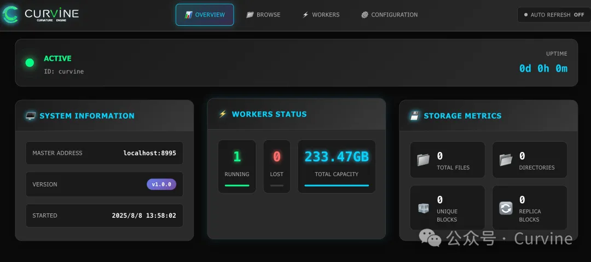

# Building a Curvine Cluster from Scratch & FIO Testing

How to quickly get started and try out Curvine's performance? This article will introduce how to build a local small cluster from scratch, allowing everyone to get hands-on experience quickly.

> GitHub: https://github.com/CurvineIO/curvine

----

## 1. Download the Code:
```bash
git clone https://github.com/CurvineIO/curvine.git
```

## 2. Environment Requirements:
```bash
GCC: version 10 or later 
Rust: version 1.86 or later 
Protobuf: version 3.x
Maven: version 3.8 or later
LLVM: version 12 or later
FUSE: libfuse2 or libfuse3 development packages
JDK: version 1.8 or later 
npm: version 9 or later
Python: version 3.7 or later 
```

## 3. Compile & Run
```bash
make all
```

To facilitate compilation, our build script will check dependencies in advance. For macOS users, we will temporarily skip FUSE compilation (currently not adapted for macOS). Interested users can consider using the `macfuse` project for adaptation.


## 4. After Compilation, Start Local Cluster
```bash
cd build/dist
./bin/restart-all.sh
```

After successful startup, execute the report command to check if it's working:
```bash

bin/cv report

       active_master: localhost:8995
       journal_nodes: 1,localhost:8996
            capacity: 233.5GB
           available: 105.0GB (44.99%)
             fs_used: 0.0B (0.00%)
         non_fs_used: 128.4GB
     live_worker_num: 1
     lost_worker_num: 0
           inode_num: 0
           block_num: 0
    live_worker_list: 192.168.xxx.xxx:8997,105.0GB/233.5GB (44.99%)
    lost_worker_list:
```

## 5. View Local Master and Worker WebUI

```bash
http://localhost:9000/
http://localhost:9001/
```



## 6. FIO Testing
Test Environment: Alibaba Cloud `ecs.r8a.8xlarge` instance with one master/worker/client each
- 32 cores (vCPU)
- 256 GiB memory  
- System disk and data disk both: ESSD cloud disk 500 GiB (7800 IOPS)
- Maximum bandwidth: 25Gb

Prepare data (on worker machine):

```bash
bin/curvine-bench.sh fuse.write
```

**FIO Sequential Read Test, 8 Concurrent Jobs**

```bash
fio -iodepth=1 -rw=read -ioengine=libaio -bs=256k
 -group_reporting -size=200gb 
 -filename=/curvine-fuse/fs-bench/0  
 -name=read_test --readonly -direct=1 --runtime=60 
 -numjobs=8
```

**FIO Random Read Test, 8 Concurrent Jobs**
```bash

fio -iodepth=1 -rw=randread -ioengine=libaio -bs=256k
 -group_reporting -size=200gb 
 -filename=/curvine-fuse/fs-bench/0  
 -name=read_test --readonly -direct=1 --runtime=60
 -numjobs=8
```

Finally, here's a video demonstration of the FIO testing results: