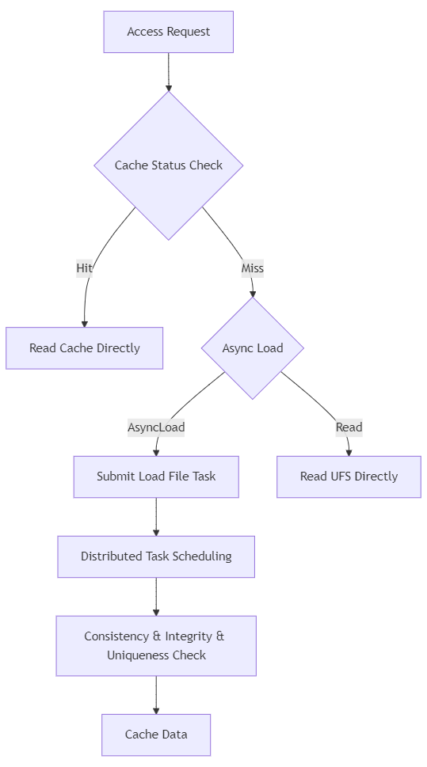
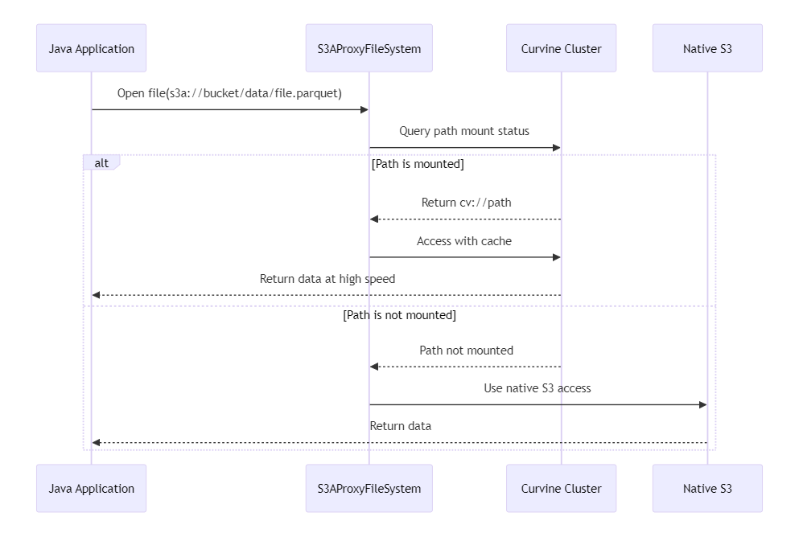
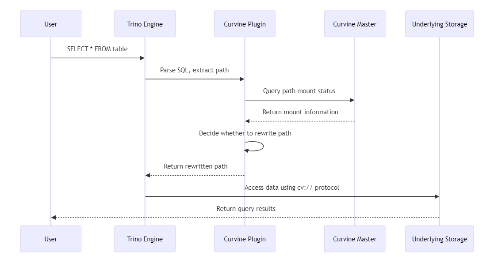

# Curvine Distributed Cache System User Guide

[](https://github.com/curvine/curvine)
[](https://www.apache.org/licenses/LICENSE-2.0)
[](https://docs.curvine.io)

## 📚 Table of Contents

- [🎯 System Overview](#-system-overview)
- [📂 Path Mount Management](#-path-mount-management)
- [💾 Intelligent Caching Strategies](#-intelligent-caching-strategies)
- [🔄 Data Consistency Guarantees](#-data-consistency-guarantees)
- [🤖 AI/ML Scenario Applications](#-aiml-scenario-applications)
- [🗄️ Big Data Ecosystem Integration](#-big-data-ecosystem-integration)
- [💡 Best Practices](#-best-practices)
- [🎯 Summary](#-summary)

---

## 🎯 System Overview

Curvine is a high-performance, cloud-native distributed caching system designed for modern data-intensive applications. It provides an intelligent caching layer between underlying storage (UFS) and compute engines, significantly improving data access performance.


### 🏆 Performance Advantages

Compared to traditional storage access methods, Curvine can provide:

| Metric | Cloud Storage | Curvine Cache | Performance Improvement |
|--------|---------------|---------------|-------------------------|
| **Read Latency** | 100-500ms | 1-10ms | **10-50x** |
| **Throughput** | 100-500 MB/s | 1-10 GB/s | **10-20x** |
| **IOPS** | 1K-10K | 100K-1M | **100x** |
| **Concurrent Connections** | 100-1K | 10K-100K | **100x** |

---

### Core Components

- **Master Cluster**: Metadata management, cache scheduling, consistency guarantees
- **Worker Nodes**: Data caching, I/O processing, task execution
- **Client SDK**: Multi-language clients, supporting Rust, Fuse, Java, Python
- **Job Manager**: Distributed task scheduling and management
- **Metrics System**: Real-time monitoring and performance analysis

---


## 📂 Path Mount Management

Mounting is the first step in using Curvine cache, which establishes the mapping relationship between underlying storage (UFS) and cache paths.

### Mounting Modes Explained

Curvine supports two flexible mounting modes:

#### 🎯 CST Mode (Consistent Path Mode)
```bash
# Consistent path, easy to manage and maintain
bin/cv mount s3://bucket/data /bucket/data --mnt-type cst
```

**Ideal scenarios**:
- Data lake scenarios with clear path structures
- Production environments requiring intuitive path mapping
- Data platforms with multi-team collaboration

#### 🔀 Arch Mode (Orchestration Mode)
```bash
# Flexible path mapping, supporting complex path transformations
bin/cv mount s3://complex-bucket/deep/nested/path /simple/data --mnt-type arch
```

**Ideal scenarios**:
- Complex storage hierarchies
- Scenarios requiring path abstraction
- Multi-cloud storage unified access

### Complete Mounting Example

```bash
# Mount S3 storage to Curvine (production-grade configuration)
bin/cv mount \
s3://bucket/warehouse/tpch_500g.db/orders \
/bucket/warehouse/tpch_500g.db/orders \
--ttl-ms 24h \
--ttl-action delete \
--replicas 3 \
--block-size 128MB \
--consistency-strategy always \
--storage-type ssd \
-c s3.endpoint_url=https://s3.ap-southeast-1.amazonaws.com \
-c s3.credentials.access=access_key \
-c s3.credentials.secret=secret_key \
-c s3.region_name=ap-southeast-1 
```

### Mounting Parameters Explained

| Parameter | Type | Default | Description | Example |
|-----------|------|---------|-------------|---------|
| `--ttl-ms` | duration | `0` | Cache data expiration time | `24h`, `7d`, `30d` |
| `--ttl-action` | enum | `none` | Expiration policy: `delete`/`none` | `delete` |
| `--replicas` | int | `1` | Number of data replicas (1-5) | `3` |
| `--block-size` | size | `128MB` | Cache block size | `64MB`, `128MB`, `256MB` |
| `--consistency-strategy` | enum | `always` | Consistency strategy | `none`/`always`/`period` |
| `--storage-type` | enum | `disk` | Storage medium type | `mem`/`ssd`/`disk` |

### Mount Point Management

```bash
# View all mount points
bin/cv mount

# Unmount path
bin/cv unmount /bucket/warehouse/tpch_500g.db/orders
```

---

## 💾 Intelligent Caching Strategies

Curvine provides multiple intelligent caching strategies, from passive response to active prediction, comprehensively optimizing data access performance.

### Active Data Preloading

Active loading allows you to warm up the cache before business peaks to ensure optimal performance:

```bash
# Basic loading
bin/cv load s3:/bucket/warehouse/critical-dataset

# Synchronous loading with progress monitoring
bin/cv load s3:/bucket/warehouse/critical-dataset -w

```

### Automatic Caching Strategy

Curvine's automatic caching system has significant advantages over traditional solutions:

#### ✨ Curvine Intelligent Cache Architecture



#### Core Advantage Comparison

| Feature | Open Source Competitors | Curvine | Advantage Description |
|---------|--------------------|---------|-----------------------|
| **Loading Granularity** | Block-level | File/Directory-level | Avoid fragmentation, ensure integrity |
| **Duplicate Processing** | Exists duplicate loading | Intelligent deduplication | Save bandwidth and storage resources |
| **Task Scheduling** | Simple queue | Distributed Job Manager | Efficient concurrency, load balancing |
| **Consistency Guarantee** | Passive checking | Active awareness | Real-time data synchronization |

---

## 🔄 Data Consistency Guarantees

Data consistency is a core challenge for caching systems, and Curvine provides multi-level consistency guarantee mechanisms.

### Consistency Strategy Details

#### 1. 🚫 None Mode - Highest Performance
```bash
bin/cv mount s3://bucket/path /bucket/path --consistency-strategy=none
```
- **Ideal scenarios**: Static data, archived data, read-only datasets
- **Performance**: ⭐⭐⭐⭐⭐ (fastest)
- **Consistency**: ⭐⭐ (TTL-dependent)

#### 2. ✅ Always Mode - Strong Consistency
```bash
bin/cv mount s3://bucket/path /bucket/path --consistency-strategy=always
```
- **Ideal scenarios**: Frequently updated business data, critical business systems
- **Performance**: ⭐⭐⭐ (has overhead)
- **Consistency**: ⭐⭐⭐⭐⭐ (strong consistency)

#### 3. 🕰️ Period Mode - Balanced Solution
```bash
bin/cv mount s3://bucket/path /bucket/path \
  --consistency-strategy=period \
  --check-interval=5m
```
- **Ideal scenarios**: Data with predictable update frequency
- **Performance**: ⭐⭐⭐⭐ (good)
- **Consistency**: ⭐⭐⭐⭐ (periodically guaranteed)

### Cache Performance Monitoring

Monitoring cache hit ratio is an important way to evaluate the effectiveness of consistency strategies:

```bash
# Get cache hit ratio
curl -s http://master:9001/metrics | grep -E "(cache_hits|cache_misses)"
```

```prometheus
client_mount_cache_hits{id="3108497238"} 823307
client_mount_cache_misses{id="3108497238"} 4380
```

---

## 🤖 AI/ML Scenario Applications

AI and machine learning workloads have extremely high requirements for storage performance, and Curvine provides specially optimized functions for this.

### Deep Learning Training Optimization

```bash
# Optimized data loading for GPU clusters
bin/cv mount s3://datasets/imagenet /datasets/imagenet \
  --storage-type=mem \
  --block-size=1GB \
  --replicas=2 

```

### Model Serving Scenarios

```bash
# Model file caching (low-latency access)
bin/cv mount s3://model/bert-large /models/bert-large \
  --storage-type=mem \
  --ttl-ms=none \
  --consistency-strategy=always 

# Inference data caching
bin/cv mount s3://inference/input /inference/input \
  --storage-type=ssd \
  --ttl-ms=1h \
  --consistency-strategy=none 
```


### 🔗 POSIX Semantics and FUSE Access

Curvine perfectly supports POSIX semantics through the FUSE (Filesystem in Userspace) interface, allowing the Curvine cluster to be mounted as a local file system, providing a transparent file access experience for AI/ML applications.


#### FUSE Usage in AI/ML Training

##### 1. Deep Learning Training Data Access

```python
# PyTorch training script
import torch
from torch.utils.data import Dataset, DataLoader
from torchvision import transforms
from PIL import Image
import os

class CurvineImageDataset(Dataset):
    def __init__(self, root_dir, transform=None):
        """
        Directly access data in Curvine through FUSE mount point
        root_dir: FUSE mount point path, such as /curvine-fuse/datasets/imagenet
        """
        self.root_dir = root_dir
        self.transform = transform
        self.image_paths = []
        
        # Directly traverse the FUSE-mounted directory
        for class_dir in os.listdir(root_dir):
            class_path = os.path.join(root_dir, class_dir)
            if os.path.isdir(class_path):
                for img_file in os.listdir(class_path):
                    if img_file.lower().endswith(('.png', '.jpg', '.jpeg')):
                        self.image_paths.append(os.path.join(class_path, img_file))
    
    def __len__(self):
        return len(self.image_paths)
    
    def __getitem__(self, idx):
        # Access data through standard file operations, enjoying Curvine cache acceleration
        img_path = self.image_paths[idx]
        image = Image.open(img_path).convert('RGB')
        
        if self.transform:
            image = self.transform(image)
            
        # Extract label from path
        label = os.path.basename(os.path.dirname(img_path))
        return image, label

# Usage example
transform = transforms.Compose([
    transforms.Resize((224, 224)),
    transforms.ToTensor(),
    transforms.Normalize(mean=[0.485, 0.456, 0.406], 
                        std=[0.229, 0.224, 0.225])
])

# Directly use the path of the FUSE mount point
dataset = CurvineImageDataset(
    root_dir='/curvine-fuse/datasets/imagenet/train',
    transform=transform
)

dataloader = DataLoader(
    dataset, 
    batch_size=64, 
    shuffle=True, 
    num_workers=8,
    pin_memory=True
)

# Training loop
for epoch in range(num_epochs):
    for batch_idx, (data, targets) in enumerate(dataloader):
        # Data is automatically loaded from Curvine cache through FUSE
        # Enjoy near-memory access speed
        outputs = model(data.cuda())
        loss = criterion(outputs, targets.cuda())
        # ... training logic
```

##### 2. TensorFlow/Keras Data Pipeline

```python
import tensorflow as tf
import os

def create_curvine_dataset(data_dir, batch_size=32):
    """
    Create TensorFlow data pipeline through FUSE mount point
    data_dir: FUSE-mounted data directory
    """
    
    # Directly access FUSE-mounted data using standard file APIs
    def load_and_preprocess_image(path):
        # TensorFlow transparently accesses Curvine cache through FUSE
        image = tf.io.read_file(path)
        image = tf.image.decode_jpeg(image, channels=3)
        image = tf.image.resize(image, [224, 224])
        image = tf.cast(image, tf.float32) / 255.0
        return image
    
    # Scan files in the FUSE-mounted directory
    image_paths = []
    labels = []
    
    for class_name in os.listdir(data_dir):
        class_dir = os.path.join(data_dir, class_name)
        if os.path.isdir(class_dir):
            for img_file in os.listdir(class_dir):
                if img_file.lower().endswith(('.png', '.jpg', '.jpeg')):
                    image_paths.append(os.path.join(class_dir, img_file))
                    labels.append(class_name)
    
    # Create dataset
    path_ds = tf.data.Dataset.from_tensor_slices(image_paths)
    label_ds = tf.data.Dataset.from_tensor_slices(labels)
    
    # Apply preprocessing
    image_ds = path_ds.map(
        load_and_preprocess_image, 
        num_parallel_calls=tf.data.AUTOTUNE
    )
    
    # Combine data and labels
    dataset = tf.data.Dataset.zip((image_ds, label_ds))
    
    return dataset.batch(batch_size).prefetch(tf.data.AUTOTUNE)

# Usage example
train_dataset = create_curvine_dataset('/curvine-fuse/datasets/imagenet/train')
val_dataset = create_curvine_dataset('/curvine-fuse/datasets/imagenet/val')

# Model training
model.fit(
    train_dataset,
    validation_data=val_dataset,
    epochs=50,
    callbacks=[
        tf.keras.callbacks.ModelCheckpoint('/curvine-fuse/models/checkpoints/'),
        tf.keras.callbacks.TensorBoard(log_dir='/curvine-fuse/logs/')
    ]
)
```

---

## 🗄️ Big Data Ecosystem Integration

Curvine seamlessly integrates with mainstream big data frameworks, providing transparent cache acceleration capabilities.

### Hadoop Ecosystem Integration

#### Basic Configuration

Add in `hdfs-site.xml` or `core-site.xml`:

```xml
<!-- Curvine FileSystem implementation -->
<property>
    <name>fs.cv.impl</name>
    <value>io.curvine.CurvineFileSystem</value>
</property>

<!-- Single cluster configuration -->
<property>
    <name>fs.cv.master_addrs</name>
    <value>master1:8995,master2:8995,master3:8995</value>
</property>

```

#### Multi-cluster Support

```xml
<!-- Cluster 1: Production environment -->
<property>
    <name>fs.cv.production.master_addrs</name>
    <value>prod-master1:8995,prod-master2:8995,prod-master3:8995</value>
</property>

<!-- Cluster 2: Development environment -->
<property>
    <name>fs.cv.development.master_addrs</name>
    <value>dev-master1:8995,dev-master2:8995</value>
</property>

<!-- Cluster 3: Machine learning dedicated cluster -->
<property>
    <name>fs.cv.ml-cluster.master_addrs</name>
    <value>ml-master1:8995,ml-master2:8995,ml-master3:8995</value>
</property>
```


### 🔄 UFS Transparent Proxy

To better support existing Java applications to seamlessly access Curvine cache, we provide a UFS transparent proxy solution. The core advantage of this solution is **zero code modification**, allowing existing applications to immediately enjoy the cache acceleration effects of Curvine.

#### ✨ Core Features of Transparent Proxy

- **🚫 Zero code modification**: Preserves all original interfaces unchanged, no business code modifications required
- **🔍 Intelligent path recognition**: Only determines whether the path has been mounted to Curvine when opening a file
- **⚡ Automatic cache acceleration**: Automatically enables cache acceleration for mounted paths, native S3 access for unmounted paths
- **🔄 Smooth switching**: Supports dynamically switching whether to use cache at runtime without restarting the application

#### 🛠️ Configuration Method

Simply replace the S3FileSystem implementation class in Hadoop configuration:

```xml
<!-- Traditional S3 access configuration -->
<!--
<property>
    <name>fs.s3a.impl</name>
    <value>org.apache.hadoop.fs.s3a.S3AFileSystem</value>
</property>
-->

<!-- Replace with Curvine transparent proxy -->
<property>
    <name>fs.s3a.impl</name>
    <value>io.curvine.S3AProxyFileSystem</value>
</property>

<property>
    <name>fs.cv.impl</name>
    <value>io.curvine.CurvineFileSystem</value>
</property>

<!-- Curvine cluster configuration -->
<property>
    <name>fs.curvine.master_addrs</name>
    <value>master1:8995,master2:8995,master3:8995</value>
</property>
```


#### 🔧 Working Principle



#### 🚀 Usage Example

**No need to modify any business code, original code directly enjoys acceleration:**

```java
// Business code remains completely unchanged!
Configuration conf = new Configuration();
FileSystem fs = FileSystem.get(URI.create("s3a://my-bucket/"), conf);

// If this path is mounted to Curvine, automatically enjoy cache acceleration
FSDataInputStream input = fs.open(new Path("s3a://my-bucket/warehouse/data.parquet"));

// If this path is not mounted, use native S3 access
FSDataInputStream input2 = fs.open(new Path("s3a://my-bucket/archive/old-data.parquet"));
```

**Spark/MapReduce code example:**

```java
// Spark code does not need any modification
Dataset<Row> df = spark.read()
    .option("header", "true")
    // If /warehouse/ path is mounted, automatically use cache acceleration
    .csv("s3a://data-lake/warehouse/customer_data/");
    
df.groupBy("region")
  .agg(sum("revenue").alias("total_revenue"))
  .orderBy(desc("total_revenue"))
  .show(20);
```

**Python PySpark example:**

```python
# Python code also does not need modification
from pyspark.sql import SparkSession
from pyspark.sql.functions import sum, desc

spark = SparkSession.builder.appName("TransparentCache").getOrCreate()

# Automatically determine whether to use cache
df = spark.read \
    .option("header", "true") \
    .csv("s3a://data-lake/analytics/events/")

result = df.groupBy("event_type") \
    .agg(sum("count").alias("total_events")) \
    .orderBy(desc("total_events"))
    
result.show()
```

### Apache Spark Optimization Configuration

```bash
# Spark application startup configuration
spark-submit \
  --class com.example.SparkApp \
  --master yarn \
  --deploy-mode cluster \
  --conf spark.hadoop.fs.cv.impl=io.curvine.CurvineFileSystem \
  --conf spark.hadoop.fs.cv.master_addrs=master1:8995,master2:8995,master3:8995 \
  --conf spark.sql.adaptive.enabled=true \
  --jars curvine-hadoop-client.jar \
  app.jar
```

#### Spark Code Example

```scala
// Scala example
val spark = SparkSession.builder()
  .appName("Curvine Demo")
  .config("spark.hadoop.fs.cv.impl", "io.curvine.CurvineFileSystem")
  .getOrCreate()

// Directly use cv:// protocol to access cached data
val df = spark.read
  .option("multiline", "true")
  .json("cv://production/warehouse/events/2024/01/01/")

df.groupBy("event_type")
  .count()
  .show()

// Multi-cluster access
val prodData = spark.read.parquet("cv://production/warehouse/sales/")
val mlData = spark.read.parquet("cv://ml-cluster/features/user_profiles/")
```

```python
# Python example
from pyspark.sql import SparkSession

spark = SparkSession.builder \
    .appName("Curvine Python Demo") \
    .config("spark.hadoop.fs.cv.impl", "io.curvine.CurvineFileSystem") \
    .config("spark.hadoop.fs.cv.master_addrs", "master1:8995,master2:8995") \
    .getOrCreate()

# Read data from cache
df = spark.read.option("header", "true") \
    .csv("cv://warehouse/customer_data/")

# Complex queries automatically enjoy cache acceleration
result = df.groupBy("region") \
    .agg({"revenue": "sum", "orders": "count"}) \
    .orderBy("sum(revenue)", ascending=False)

result.show(20)
```

### Trino/Presto Plugin Integration

Curvine provides an intelligent path replacement plugin, which can achieve non-invasive cache acceleration without requiring business code modifications, achieving completely transparent cache acceleration:

#### Plugin Workflow



Spark plugin usage example:
```
spark-submit \
--class main.scala.Tpch \
--name tpch_demo \
--conf spark.hadoop.fs.cv.impl=io.curvine.CurvineFileSystem \
--conf spark.hadoop.fs.cv.default.master_addrs=master1:8995,master2:8995 \
--conf spark.sql.extensions=io.curvine.spark.CurvineSparkExtension \
```

### Flink Real-time Computing Integration

```java
// Flink Table API integration example
TableEnvironment tableEnv = TableEnvironment.create(settings);

// Configure Curvine FileSystem
Configuration config = new Configuration();
config.setString("fs.cv.impl", "io.curvine.CurvineFileSystem");
config.setString("fs.cv.master_addrs", "master1:8995,master2:8995");

// Create Curvine table
tableEnv.executeSql(
    "CREATE TABLE user_events (" +
    "  user_id BIGINT," +
    "  event_type STRING," +
    "  timestamp_ms BIGINT," +
    "  properties MAP<STRING, STRING>" +
    ") WITH (" +
    "  'connector' = 'filesystem'," +
    "  'path' = 'cv://streaming/events/'," +
    "  'format' = 'json'" +
    ")"
);

// Real-time query enjoys cache acceleration
Table result = tableEnv.sqlQuery(
    "SELECT user_id, COUNT(*) as event_count " +
    "FROM user_events " +
    "WHERE timestamp_ms > UNIX_TIMESTAMP() * 1000 - 3600000 " +
    "GROUP BY user_id"
);
```

---


---

## 💡 Best Practices

### 🎯 Mounting Strategy Best Practices

#### Tiered Mounting by Business Scenarios

```bash
# Hot data: high-frequency access, using memory cache
bin/cv mount s3://bucket/hot /bucket/hot \
  --storage-type=mem \
  --replicas=3 \
  --ttl-ms=1d \
  --ttl-action=delete

# Warm data: regular access, using SSD cache
bin/cv mount s3://bucket/warm /bucket/warm \
  --storage-type=ssd \
  --replicas=2 \
  --ttl-ms=7d \
  --ttl-action=delete


# Cold data: low-frequency access, using disk cache
bin/cv mount s3://bucket/cold /bucket/cold \
  --storage-type=disk \
  --replicas=1 \
  --ttl-ms=30d \
  --ttl-action=delete
```

#### Optimization by Data Type

```bash
# Small file intensive (e.g., logs, configurations)
bin/cv mount s3://bucket/logs /bucket/logs \
  --block-size=4MB \
  --consistency-strategy=none 

# Large file type (e.g., videos, models)
bin/cv mount s3://bucket/models /bucket/models \
  --block-size=1GB \
  --consistency-strategy=always 

# Analytical data (e.g., Parquet)
bin/cv mount s3://bucket/analytics /bucket/analytics \
  --block-size=128MB \
  --consistency-strategy=none \
```
---

## 🎯 Summary

As a new generation distributed caching system, Curvine provides excellent performance improvements for modern data-intensive applications through intelligent caching strategies, strong consistency guarantees, and seamless ecosystem integration.

### 🏆 Core Values

- **🚀 Performance Improvement**: 10-100x access acceleration, significantly reducing data access latency
- **💰 Cost Optimization**: Reduce cloud storage access costs, improve computing resource utilization  
- **🛡️ Data Security**: Multiple consistency guarantees to ensure data accuracy and integrity
- **🌐 Ecosystem Friendly**: Seamless integration with mainstream big data and AI frameworks

---

*Curvine - Make data access lightning fast ⚡*