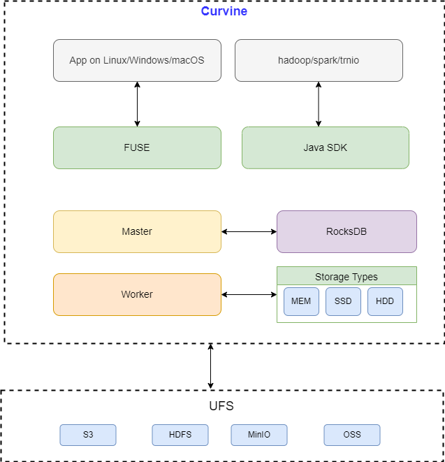

# Technical Architecture

This chapter provides an in-depth introduction to Curvine's technical architecture, detailing the functionality, interaction patterns, and design principles of each layer component to help you comprehensively understand how the Curvine system works.

## Architecture Overview

Curvine adopts a layered distributed architecture design that ensures clear component responsibilities with excellent scalability and high availability. The entire architecture is primarily divided into three layers: control layer, compute layer, and storage layer, which collaborate to complete data storage, processing, and management tasks.

Curvine cache consists of three main components:

**Curvine Client**: Data read/write operations are implemented by the client, which calls Curvine server-side interfaces through RPC to perform data read/write operations. The client needs to interact with both Master and Worker nodes. The client supports multiple access methods:

- **FUSE**: Curvine mounts to servers in a POSIX-compatible manner, functioning as local storage
- **Hadoop Java SDK**: Curvine provides Hadoop Java SDK supporting the Hadoop ecosystem
- **Rust SDK**: Curvine provides Rust SDK supporting the Rust ecosystem

**Master**: The core control node of the system, responsible for cluster state management, task scheduling, metadata management, and other critical functions. Master achieves distributed consistency and high availability through Raft protocol without depending on external components.

**Worker**: Responsible for actual data storage and management, handling data read/write requests

**UFS**: Curvine provides users with a unified file system view through data orchestration technology.

## High-Performance Design

To achieve high performance, high concurrency, and low resource consumption, Curvine adopts the following technologies and design principles:

- **Pure Rust Implementation**: Curvine is implemented entirely in Rust, avoiding performance bottlenecks and resource consumption of traditional languages while ensuring code safety and stability
- **High-Performance RPC Framework**: Curvine implements a custom RPC communication framework supporting efficient data transmission with asynchronous I/O and zero-copy implementation within the framework
- **Zero-Cost Abstractions**: Zero-cost abstraction design where core modules directly interface with underlying systems, avoiding unnecessary abstraction layers and improving system performance and resource utilization
- **Asynchronous I/O**: Asynchronous I/O design fully utilizes system resources, avoiding blocking waits and improving system concurrent processing capabilities
- **Zero-Copy**: Zero-copy design avoids data copying and memory allocation, reducing system memory usage and resource consumption

## High Availability Design

Curvine adopts distributed architecture design with multi-replica mechanisms and failover mechanisms to ensure system high availability:

- **Raft Protocol**: Uses Raft protocol to implement distributed consistency, ensuring data consistency and reliability
- **Automatic Failover**: Automatic failover mechanism that switches to backup nodes when primary nodes fail, ensuring system high availability
- **Multi-Replica Mechanism**: Multi-replica mechanism ensures data redundancy backup, improving system reliability and fault tolerance
- **Snapshot Mechanism**: Lightweight snapshot mechanism for periodic data backup, improving system recovery speed and stability