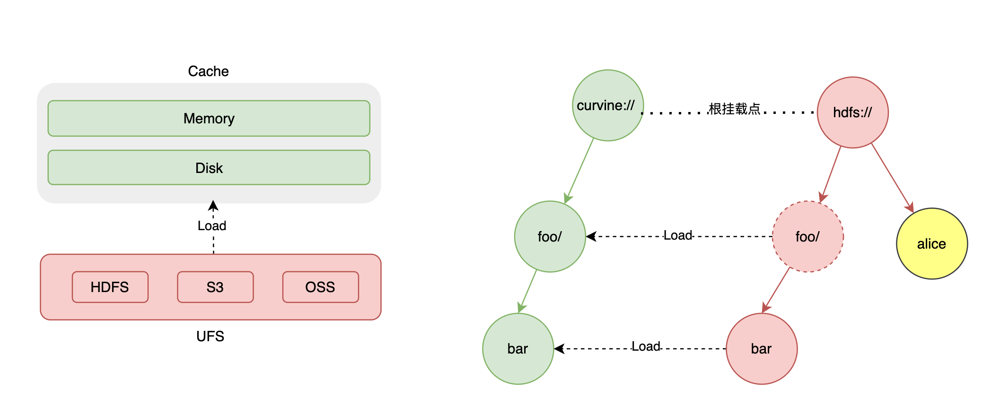

# Data Orchestration

Curvine provides UFS (Unified File System) view to manage all supported distributed storage systems, including S3, HDFS, and others.

## Mounting

Curvine supports connecting multiple UFS sources by mounting them to different Curvine paths. Curvine does not provide default UFS configuration, which means if you want to load data from UFS, you must first mount the UFS source.



Curvine persists the mount table in metadata, so there is no need to remount when Curvine restarts. However, some rules must be followed.
- Mounting to the root path is not allowed.
- Mounting other UFS under a mounted path is not allowed.
- The same mount path cannot be mounted to different UFS.

Mount:
```bash
bin/cv mount ufs_path curvine_path [configs]
```

- ufs_path: UFS path, e.g., s3://bucket/path.
- curvine_path: Curvine path, e.g., /ufs/path.
- configs: Optional parameters, e.g., access_key_id, secret_access_key, region, endpoint, etc.

Example:
```
bin/cv mount s3://ai/xuen-test /s3 \
-c s3.endpoint_url=http://hostname.com \
-c s3.region_name=cn \
-c s3.credentials.access=access_key \
-c s3.credentials.secret=secret_key \
-c s3.path_style=true
```

:::tip
You can use command line, API to access ufs directories and files after UFS is mounted, but ufs data will not be automatically synchronized to curvine unless you load specific paths.
:::

## Unified Access
After UFS is mounted, Curvine provides a unified file system view, and you can access the UFS file system just like accessing the Curvine file system;
Clients, command line tools, fuse, etc. can all access the UFS file system through a unified path.

:::tip
Curvine does not cache UFS metadata, so there is no data consistency issue when accessing. Accessing UFS through Curvine is no different from accessing UFS directly.
:::

## Disabling Unified Access
If you don't want to use unified access, you can add or modify the following configuration:
```
[client]
enable_unified_fs = false
```