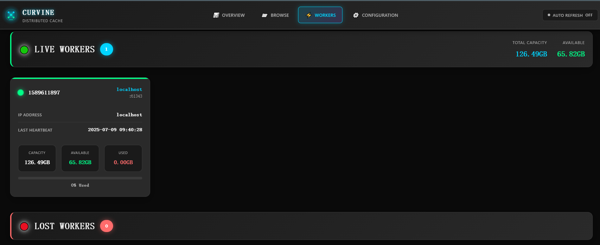

# Web Management Interface

Curvine provides an intuitive and user-friendly web management interface that allows users to monitor cluster status in real-time, manage file systems, view worker node information, and configure system parameters through a web browser. The web interface serves as a visual operations platform for cluster operations and daily management, enabling most administrative tasks to be completed without complex command-line operations.

## Overview - Cluster Overview

The Overview page provides a comprehensive view of the Curvine cluster's overall operational status and serves as the core dashboard for cluster monitoring.

### Cluster Status Information
- **Cluster Status**: Displays whether the cluster is currently active, including uptime information
- **Master Node Address**: Shows the access address and port of the Master node
- **Version Information**: Displays the current running Curvine version number
- **Startup Time**: Shows the cluster startup timestamp

### Worker Node Status
- **Active Worker Count**: Real-time display of currently online Worker nodes
- **Offline Worker Count**: Shows currently offline or failed Worker nodes
- **Node Status Indicators**: Visual display of node health status through color coding

### Storage Capacity Statistics
- **Total Storage Capacity**: Displays the total storage capacity of the cluster
- **Used Storage Space**: Shows currently used storage space
- **Available Storage Space**: Shows remaining available storage space
- **Capacity Utilization**: Displays storage usage rate through progress bars and percentages

### File System Statistics
- **Total File Count**: Displays the total number of files in the file system
- **Directory Count**: Shows the number of directories in the file system
- **Data Block Statistics**: Displays the count of unique data blocks and replica data blocks

Through the Overview page, administrators can quickly understand the overall health status of the cluster, identify potential issues promptly, and take appropriate actions.

## Browse - File System Browser

The Browse page provides a file manager-like interface that allows users to browse and manage files and directories in the Curvine file system.

### File System Navigation
- **Path Navigation Bar**: Displays the current file system path with support for quick navigation
- **Navigate Button**: Provides a "Navigate" button for path jumping
- **Breadcrumb Navigation**: Shows the complete directory hierarchy structure

### File and Directory Management
- **File List View**: Displays files and subdirectories in the current directory in list format
- **File Details**: Shows file size, modification time, permissions, and other attribute information
- **Directory Operations**: Supports creating new directories, deleting directories, and other operations
- **File Operations**: Supports basic file operations such as viewing, downloading, and deleting files

### Storage Statistics
- **Directory Item Count**: Displays the number of files and subdirectories in the current directory
- **Grid View Button**: Provides grid view toggle option for different browsing needs

### Empty Directory Notification
When a directory is empty, the interface displays a friendly message: "Directory is empty - No files or folders found in this location", helping users understand the current state.

The Browse page enables users to intuitively manage the distributed file system, making it as simple and convenient as operating a local file system.

## Workers - Worker Node Management

The Workers page is specifically designed for monitoring and managing worker nodes in the cluster, providing detailed node status information and performance metrics.

### Real-time Node Status
- **Total Capacity Display**: Shows the total storage capacity of all worker nodes
- **Available Capacity Display**: Shows the currently available storage capacity
- **Capacity Statistics**: Real-time updated capacity usage information

### Active Worker Node List
For each online worker node, the following detailed information is displayed:
- **Node ID**: Unique identifier for the worker node
- **IP Address**: Network address of the worker node
- **Last Heartbeat Time**: Shows the last communication time between the node and Master
- **Node Capacity Information**:
  - Total Capacity: Total storage capacity of the node
  - Available Capacity: Currently available storage space of the node
  - Used Capacity: Currently used storage space of the node
- **Usage Rate Indicator**: Visual display of node storage usage rate through progress bars

### Offline Node Monitoring
- **Offline Node List**: Displays currently offline or unresponsive worker nodes
- **Fault Detection**: Helps administrators quickly identify problematic nodes
- **Node Recovery Status**: Tracks the recovery status of offline nodes

### Cluster Health Monitoring
Through the Workers page, administrators can:
- Monitor the health status and performance of individual nodes
- Promptly identify storage capacity shortages or node failure issues
- Evaluate cluster load distribution and resource utilization
- Provide decision support for cluster scaling or maintenance

## Configuration - System Configuration

The Configuration page provides detailed configuration information viewing functionality for the Curvine cluster, helping administrators understand and verify system configurations.

### Configuration Parameter Display
The page displays all important system configuration parameters in table format:

#### Formatting Configuration
- **format_master**: Master node formatting status
- **format_worker**: Worker node formatting status

#### Testing and Debugging Configuration
- **testing**: Test mode switch status

#### Cluster Identification
- **cluster_id**: Unique identifier for the cluster

#### Network Configuration
- **master_hostname**: Hostname of the Master node
- **master_rpc_port**: RPC service port of the Master node
- **master_web_port**: Web service port of the Master node

#### Performance Tuning Parameters
- **master_io_threads**: Number of IO threads for the Master node
- **master_worker_threads**: Number of worker threads for the Master node
- **master_io_timeout**: IO timeout for the Master node
- **master_io_close_idle**: Idle connection closure configuration for the Master node

#### Metadata Management
- **master_meta_dir**: Metadata storage directory for the Master node
- **master_meta_disable_wal**: Metadata WAL logging switch
- **master_meta_compression_type**: Metadata compression type

### Configuration Validation and Diagnostics
Through the Configuration page, administrators can:
- **Verify Configuration Correctness**: Confirm that configuration parameters meet expectations
- **Performance Tuning Reference**: Evaluate performance optimization opportunities based on current configuration
- **Troubleshooting Support**: Quickly check relevant configurations when issues arise
- **Cluster Comparison**: Compare configuration differences between different environments

### Configuration Management Best Practices
- Regularly check key configuration parameters to ensure they match business requirements
- Record current configuration as a baseline before performance tuning
- Verify that changes take effect through this page after configuration modifications
- Optimize thread counts, timeout values, and other parameters in conjunction with performance monitoring data

Through the web management interface, Curvine provides users with comprehensive cluster management and monitoring capabilities, greatly simplifying the operational work of distributed cache systems and improving management efficiency and system observability.