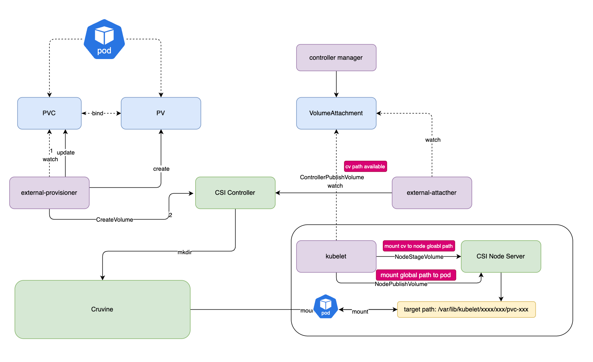

# Curvine CSI Driver
To make it easier to access Curvine in a cloud-native environment, Curvine provides CSI driver support. Your Pod containers can easily access Curvine through `PV` (Persistent Volume).

The Curvine CSI driver follows the standard CSI specification, including:
- `CSI Controller`, deployed in Deployment mode or Statefuleset mode
- `CSI Node Plugin`, deployed in DaemonSet mode

The deployment scripts are located in the `curvine-csi/deploy` project. Execute:
```bash
kubectl create -f curvine-csi/deploy
```

After correct deployment, you will see the following pods:
```bash
NAME                     READY   STATUS    RESTARTS   AGE
curvine-controller-0     4/4     Running   0          4h32m
curvine-csi-node-jbvmt   3/3     Running   0          4h32m
```



:::tip
The Curvine CSI driver depends on fuse, and is established by the csi node plugin. Because CSI driver upgrades will interrupt the fuse service, proceed with caution.
:::

## Deploy CSI
First, deploy the csi driver in the k8s cluster and ensure that the csi node plugin is running properly.

### PVC+Static PV
You can manually create a static PV and bind the PVC to the static PV. Example:
```yaml
---
apiVersion: v1
kind: PersistentVolume
metadata:
  name: curvine-pv
  labels:
    type: curvine
spec:
  storageClassName: curvine-sc
  capacity:
    storage: 10Gi
  accessModes:
    - ReadWriteOnce
  persistentVolumeReclaimPolicy: Delete
  csi:
    driver: curvine
    volumeHandle: curvine-volume-1
    volumeAttributes:
      curvinePath: "/"
      type: "Directory" # Using Directory type requires that the path must already exist
```

### PVC+Dynamic PV
To use dynamic PV, you need to define a `StorageClass` first.

`StorageClass` example:

```yaml
apiVersion: storage.k8s.io/v1
kind: StorageClass
metadata:
  name: curvine-sc
provisioner: curvine
reclaimPolicy: Delete
volumeBindingMode: Immediate
allowVolumeExpansion: true
parameters:
  curvinePath: "/"
  type: "DirectoryOrCreate" #"DirectoryOrCreate" or "Directory"
```

PVC example:
```yaml
---
apiVersion: v1
kind: PersistentVolumeClaim
metadata:
  name: curvine-pvc
spec:
  storageClassName: curvine-sc
  accessModes:
    - ReadWriteOnce
  resources:
    requests:
      storage: 5Gi
```