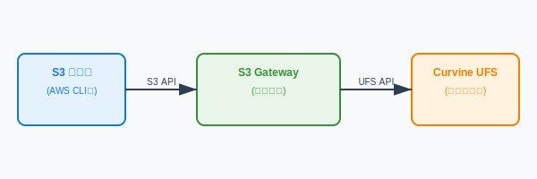

# S3 Object Storage Gateway

## Overview

The Curvine S3 Object Storage Gateway is a high-performance, enterprise-grade S3-compatible gateway that provides standard AWS S3 API access to the Curvine distributed file caching system. Through this gateway, users can access Curvine stored data using any S3 protocol-compatible tools and applications.

### Key Features

- **Full S3 API Compatibility**: Supports all common S3 operations including object and bucket management
- **High-Performance Architecture**: Built with Rust and Axum for asynchronous high-throughput processing
- **Enterprise Security**: Supports AWS Signature V2/V4 authentication with comprehensive access control
- **Flexible Deployment**: Supports standalone deployment
- **Streaming Operations**: Memory-efficient handling of large files
- **Range Requests**: Supports HTTP Range requests and partial content downloads
- **Multipart Upload**: Supports chunked uploads for large files
- **Load Balancing**: Supports multi-instance deployment for enhanced performance

### Architecture Overview

The S3 gateway serves as the frontend interface for the Curvine system, converting standard S3 API requests into Curvine filesystem operations:



## Supported S3 Operations

### Object Operations
- `PutObject` - Upload objects
- `GetObject` - Download objects
- `HeadObject` - Retrieve object metadata
- `DeleteObject` - Delete objects
- `CopyObject` - Copy objects (planned)

### Bucket Operations
- `CreateBucket` - Create buckets
- `DeleteBucket` - Delete buckets
- `HeadBucket` - Check bucket existence
- `ListObjects` - List objects in bucket
- `GetBucketLocation` - Get bucket location

### Advanced Features
- **Range Requests**: Support HTTP Range headers for partial content downloads
- **Multipart Upload**: Support chunked uploads for large files
- **Streaming Transfer**: Memory-efficient large file transfers

## Service Management

The S3 gateway provides convenient service management scripts located at `build/bin/curvine-s3-gateway.sh`.

### Start Service

```bash
# Start with default configuration
./build/bin/curvine-s3-gateway.sh start

# Start with custom configuration file
./build/bin/curvine-s3-gateway.sh start --conf /path/to/curvine-cluster.toml

# Start with custom listen address and region
./build/bin/curvine-s3-gateway.sh start \
    --listen 0.0.0.0:9000 \
    --region us-west-2
```

### Stop Service

```bash
# Gracefully stop service
./build/bin/curvine-s3-gateway.sh stop
```

### Check Service Status

```bash
# Check service running status
./build/bin/curvine-s3-gateway.sh status
```

### Restart Service

```bash
# Restart service
./build/bin/curvine-s3-gateway.sh restart
```

### View Logs

```bash
# View real-time logs
tail -f ${CURVINE_HOME}/logs/curvine-s3-gateway.out

# View recent logs
tail -100 ${CURVINE_HOME}/logs/curvine-s3-gateway.out
```

## Startup Parameters

### Command Line Arguments

| Parameter | Description | Default | Example |
|-----------|-------------|---------|---------|
| `--conf` | Configuration file path | `${CURVINE_HOME}/conf/curvine-cluster.toml` | `--conf /etc/curvine.toml` |
| `--listen` | Listen address and port | `0.0.0.0:9900` | `--listen 127.0.0.1:9000` |
| `--region` | S3 region identifier | `us-east-1` | `--region us-west-2` |

### Configuration File Parameters

The `[s3_gateway]` section in `curvine-cluster.toml` supports the following configuration parameters:

| Parameter | Type | Default | Description |
|-----------|------|---------|-------------|
| `listen` | string | `"0.0.0.0:9900"` | S3 gateway listen address and port |
| `region` | string | `"us-east-1"` | S3 region identifier |
| `put_temp_dir` | string | `"/tmp/curvine-temp"` | Temporary directory for all PUT operations (multipart and regular) |
| `put_memory_buffer_threshold` | integer | `1048576` | Memory buffer threshold for small files (bytes, default: 1MB) |
| `put_max_memory_buffer` | integer | `16777216` | Maximum memory buffer size (bytes, default: 16MB) |
| `get_chunk_size_mb` | float | `1.0` | GET read/write chunk size in MB (default: 1.0, options: 0.5/1/2) |
| `enable_distributed_auth` | boolean | `false` | Enable distributed authentication |
| `credentials_path` | string | See description | Credentials file path, depends on authentication mode |
| `cache_refresh_interval_secs` | integer | `30` | Cache refresh interval in seconds |

**Credentials Path Description:**

The `credentials_path` parameter value depends on the `enable_distributed_auth` setting:

- **Local Authentication Mode** (`enable_distributed_auth = false`):
  - Default path: `~/.curvine/credentials.jsonl`
  - Credentials stored in local filesystem

- **Distributed Authentication Mode** (`enable_distributed_auth = true`):
  - Default path: `/system/auth/credentials.jsonl`
  - Credentials stored in Curvine distributed filesystem

**Configuration Example:**

```toml
[s3_gateway]
# Listen address for S3 gateway (host:port)
listen = "0.0.0.0:9900"

# S3 region
region = "us-east-1"

# Temporary directory for all PUT operations (multipart and regular)
put_temp_dir = "/tmp/curvine-temp"

# Memory buffer threshold for small files (bytes, default: 1MB)
put_memory_buffer_threshold = 1048576

# Maximum memory buffer size (bytes, default: 16MB)
put_max_memory_buffer = 16777216

# GET Performance Optimization Settings
# GET read/write chunk size in MB (default: 1.0, options: 0.5/1/2)
get_chunk_size_mb = 1.0

# Authentication mode configuration
# Local authentication mode (default)
enable_distributed_auth = false
credentials_path = "~/.curvine/credentials.jsonl"

# Distributed authentication mode (optional)
# enable_distributed_auth = true
# credentials_path = "/system/auth/credentials.jsonl"

# Cache refresh interval in seconds
cache_refresh_interval_secs = 30
```

### Environment Variables

| Variable | Description | Notes |
|----------|-------------|-------|
| `AWS_ACCESS_KEY_ID` or `S3_ACCESS_KEY` | S3 access key | Read from environment variables at startup, no default value |
| `AWS_SECRET_ACCESS_KEY` or `S3_SECRET_KEY` | S3 secret key | Read from environment variables at startup, no default value |
| `RUST_LOG` | Log level | Default `info`, can be set to `debug`, `trace`, etc. |

**Credential Environment Variables:**

The gateway automatically reads the following environment variables as default credentials at startup:

```bash
# Set access key (choose either one)
export AWS_ACCESS_KEY_ID="your-access-key"
# or
export S3_ACCESS_KEY="your-access-key"

# Set secret key (choose either one)
export AWS_SECRET_ACCESS_KEY="your-secret-key"
# or
export S3_SECRET_KEY="your-secret-key"
```

If these environment variables are set, the gateway will automatically add these credentials to the credential store at startup, without manual configuration.

## Credential Management

The S3 gateway provides comprehensive credential management functionality, supporting adding, generating, listing, and managing access credentials.

### Add Credentials

```bash
# Add new access credentials
./build/bin/curvine-s3-gateway.sh credential add \
    --access-key AKIAEXAMPLEKEY123 \
    --secret-key wJalrXUtnFEMI/K7MDENG/bPxRfiCYEXAMPLEKEY \
    --description "Production access key"
```

### Generate Random Credentials

```bash
# Generate new random credentials
./build/bin/curvine-s3-gateway.sh credential generate \
    --description "Auto-generated test key"
```

### List Credentials

```bash
# List all credentials (secrets hidden)
./build/bin/curvine-s3-gateway.sh credential list

# Show complete credential information (including secrets)
./build/bin/curvine-s3-gateway.sh credential list --show-secrets
```

### View Cache Statistics

```bash
# View credential cache statistics
./build/bin/curvine-s3-gateway.sh credential stats
```

### Credential Storage

Credentials are stored in JSONL format:

- **Local mode**: `~/.curvine/credentials.jsonl`
- **Distributed mode**: `/system/auth/credentials.jsonl`

Each credential entry contains:
```json
{
  "access_key": "AKIAEXAMPLEKEY123",
  "secret_key": "wJalrXUtnFEMI/K7MDENG/bPxRfiCYEXAMPLEKEY",
  "created_at": 1640995200,
  "enabled": true,
  "description": "Production access key"
}
```

## Usage Examples

### AWS CLI

```bash
# Configure environment variables
export AWS_ACCESS_KEY_ID=AqU4axe4feDyIielarPI
export AWS_SECRET_ACCESS_KEY=0CJZ2QfHi2tDb4DKuCJ2vnBEUXg5EYQt
export AWS_DEFAULT_REGION=us-east-1

# Create bucket
aws s3 mb s3://my-bucket --endpoint-url http://localhost:9900

# Upload file
aws s3 cp /path/to/local/file.txt s3://my-bucket/ --endpoint-url http://localhost:9900

# Download file
aws s3 cp s3://my-bucket/file.txt /tmp/ --endpoint-url http://localhost:9900

# List objects
aws s3 ls s3://my-bucket/ --endpoint-url http://localhost:9900

# Delete object
aws s3 rm s3://my-bucket/file.txt --endpoint-url http://localhost:9900

# Sync directory
aws s3 sync /local/directory s3://my-bucket/prefix/ --endpoint-url http://localhost:9900
```

### MinIO Client (mc)

```bash
# Configure MinIO client
mc alias set curvine http://localhost:9900 AqU4axe4feDyIielarPI 0CJZ2QfHi2tDb4DKuCJ2vnBEUXg5EYQt

# Create bucket
mc mb curvine/my-bucket

# Upload file
mc cp /path/to/file.txt curvine/my-bucket/

# Download file
mc cp curvine/my-bucket/file.txt /tmp/

# List contents
mc ls curvine/my-bucket/

# Mirror directory
mc mirror /local/directory curvine/my-bucket/prefix/
```

### Python boto3

```python
import boto3
from botocore.config import Config

# Create S3 client
s3_client = boto3.client(
    's3',
    endpoint_url='http://localhost:9900',
    aws_access_key_id='AqU4axe4feDyIielarPI',
    aws_secret_access_key='0CJZ2QfHi2tDb4DKuCJ2vnBEUXg5EYQt',
    region_name='us-east-1',
    config=Config(retries={'max_attempts': 3})
)

# Create bucket
s3_client.create_bucket(Bucket='my-python-bucket')

# Upload file
with open('local-file.txt', 'rb') as f:
    s3_client.put_object(Bucket='my-python-bucket', Key='remote-file.txt', Body=f)

# Download file
response = s3_client.get_object(Bucket='my-python-bucket', Key='remote-file.txt')
data = response['Body'].read()

# List objects
response = s3_client.list_objects_v2(Bucket='my-python-bucket')
for obj in response.get('Contents', []):
    print(f"Object: {obj['Key']}, Size: {obj['Size']}")
```

### Range Request Examples

```bash
# Get first 1000 bytes of a file
curl -H "Range: bytes=0-999" \
     -H "Authorization: AWS4-HMAC-SHA256 ..." \
     http://localhost:9900/my-bucket/large-file.txt

# Get last 1000 bytes of a file
curl -H "Range: bytes=-1000" \
     -H "Authorization: AWS4-HMAC-SHA256 ..." \
     http://localhost:9900/my-bucket/large-file.txt
```

## Multi-Instance Deployment

To improve performance and availability, you can deploy multiple S3 gateway instances.

> **Note**: Currently, the S3 gateway uses a centralized deployment model. The decentralized gateway capability that starts with Worker nodes is under development and will support a more distributed deployment architecture in the future.

### Load Balancer Configuration

#### Using Nginx

```nginx
upstream s3_gateway {
    server 192.168.1.10:9900 weight=1;
    server 192.168.1.11:9900 weight=1;
    server 192.168.1.12:9900 weight=1;
}

server {
    listen 80;
    server_name s3-gateway.example.com;
    
    location / {
        proxy_pass http://s3_gateway;
        proxy_set_header Host $host;
        proxy_set_header X-Real-IP $remote_addr;
        proxy_set_header X-Forwarded-For $proxy_add_x_forwarded_for;
        
        # S3-specific configuration
        proxy_buffering off;
        proxy_request_buffering off;
        client_max_body_size 0;
    }
}
```

#### Using HAProxy

```haproxy
backend s3_gateway
    balance roundrobin
    option httpchk GET /healthz
    server gateway1 192.168.1.10:9900 check
    server gateway2 192.168.1.11:9900 check
    server gateway3 192.168.1.12:9900 check

frontend s3_frontend
    bind *:80
    default_backend s3_gateway
```

### Multi-Instance Startup

Start gateway instances on each node:

```bash
# Node 1
./build/bin/curvine-s3-gateway.sh start \
    --conf /etc/curvine-cluster.toml \
    --listen 0.0.0.0:9900

# Node 2  
./build/bin/curvine-s3-gateway.sh start \
    --conf /etc/curvine-cluster.toml \
    --listen 0.0.0.0:9900

# Node 3
./build/bin/curvine-s3-gateway.sh start \
    --conf /etc/curvine-cluster.toml \
    --listen 0.0.0.0:9900
```

### High Availability Configuration

#### Configure Shared Storage

Ensure all gateway instances use the same Curvine cluster configuration:

```toml
[s3_gateway]
# Use distributed authentication for credential consistency
enable_distributed_auth = true
credentials_path = "/system/auth/credentials.jsonl"

# Shared multipart upload directory
multipart_temp = "/shared/curvine-multipart"
```

#### Health Checks

Each gateway instance provides a health check endpoint:

```bash
# Check gateway health
curl http://localhost:9900/healthz
```

### Performance Optimization

#### System-Level Optimization

```bash
# Increase file descriptor limits
ulimit -n 65536

# Optimize network parameters
echo 'net.ipv4.tcp_keepalive_time = 600' >> /etc/sysctl.conf
echo 'net.core.rmem_max = 16777216' >> /etc/sysctl.conf
echo 'net.core.wmem_max = 16777216' >> /etc/sysctl.conf
sysctl -p
```

#### Configuration Tuning

```toml
[s3_gateway]
# Optimize cache refresh interval
cache_refresh_interval_secs = 60
```


## Troubleshooting

### Common Issues

1. **Port Already in Use**
   ```bash
   # Change listen port
   ./build/bin/curvine-s3-gateway.sh start --listen 0.0.0.0:9901
   ```

2. **Authentication Failures**
   ```bash
   # Check environment variables
   echo $AWS_ACCESS_KEY_ID
   echo $AWS_SECRET_ACCESS_KEY
   
   # Check if credentials exist in credential store
   ./build/bin/curvine-s3-gateway.sh credential list
   
   # View credential store path and statistics
   ./build/bin/curvine-s3-gateway.sh credential stats
   
   # View authentication logs
   export RUST_LOG=curvine_s3_gateway::auth=debug
   ```

3. **Configuration File Errors**
   ```bash
   # Validate configuration file
   ./build/bin/curvine-s3-gateway.sh start --conf /path/to/config.toml
   
   # Use default configuration
   ./build/bin/curvine-s3-gateway.sh start
   ```

### Debug Mode

```bash
# Enable verbose logging
export RUST_LOG=debug
./build/bin/curvine-s3-gateway.sh start

# Enable trace level logging
export RUST_LOG=trace
./build/bin/curvine-s3-gateway.sh start
```

With these configurations and optimizations, you can build an efficient S3 gateway to access data cached in Curvine.
