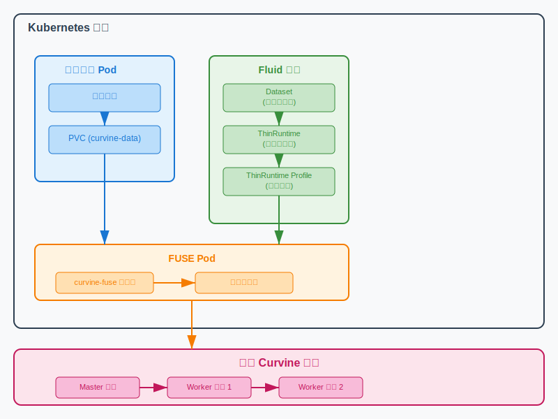
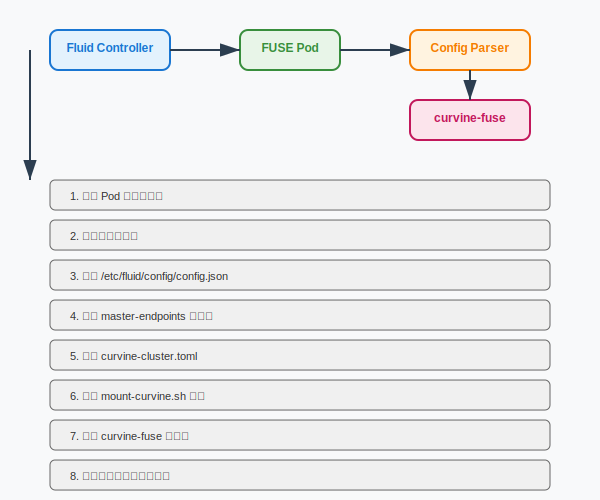

# Curvine and Fluid Integration

This document describes how to integrate Curvine distributed file caching system into Kubernetes clusters using Fluid's ThinRuntime functionality for cloud-native data orchestration and management.

## Overview

### What is Fluid

[Fluid](https://github.com/fluid-cloudnative/fluid/tree/master) is an open-source cloud-native data orchestration and management system that focuses on solving data access problems for data-intensive applications in big data and AI scenarios. It provides a unified data access interface and supports multiple data caching engines.

### What is ThinRuntime

ThinRuntime is a lightweight runtime provided by Fluid that allows users to integrate any POSIX-compatible file system into the Fluid ecosystem through the FUSE interface. Compared to traditional AlluxioRuntime or JuiceFSRuntime, ThinRuntime has the following characteristics:

- **Lightweight**: No need to deploy additional caching layers or metadata services
- **Flexibility**: Supports any FUSE-compatible file system
- **Simplicity**: Simple configuration and easy maintenance
- **Efficiency**: Direct access to underlying storage, reducing data transfer overhead

### Integration Architecture



## Prerequisites

Before starting, ensure you have:

1. **Kubernetes Cluster**: Version >= 1.18
2. **Fluid System**: Fluid >= 0.9.0 installed in the cluster
3. **Curvine Cluster**: Deployed and running Curvine distributed file system
4. **Permissions**: Ability to create ThinRuntimeProfile, Dataset, and ThinRuntime resources
5. **Docker Environment**: For building Curvine ThinRuntime image

### Install Fluid

If Fluid is not yet installed, follow these steps:

```bash
# Install Fluid using Helm
helm repo add fluid https://fluid-cloudnative.github.io/charts
helm repo update
kubectl create ns fluid-system
helm install fluid fluid/fluid --namespace=fluid-system --insecure-skip-tls-verify

# Or install development version
helm install fluid fluid/fluid --devel --version 1.0.7-alpha.5 -n fluid-system --insecure-skip-tls-verify
```

## Building Curvine ThinRuntime Image

### Step 1: Compile Curvine

First, compile the entire Curvine project:

```bash
# Execute in Curvine project root directory
cd /path/to/curvine
make all
```

**Compilation Notes**:
- `make all` compiles the entire Curvine project, including:
  - Master node program
  - Worker node program
  - FUSE client (`curvine-fuse`)
  - S3 gateway
  - CLI tools
- Build artifacts are generated in the `build/dist/` directory
- Ensure `build/dist/lib/curvine-fuse` file exists, which is the core FUSE client program

### Step 2: Build Docker Image

```bash
cd curvine-docker/fluid/thin-runtime
./build-image.sh
```

**Build Process**:

1. **Environment Check**: Script checks if necessary build files exist
2. **Create Build Context**: Copy required files to temporary directory
3. **Docker Image Build**: Uses Ubuntu 24.04 as base image
4. **Dependency Installation**: Install FUSE3, Python3, and other runtime dependencies
5. **File Copy**: Copy compiled Curvine programs to the image
6. **Permission Setup**: Set executable permissions and environment variables

After completion, the image `fluid-cloudnative/curvine-thinruntime:v1.0.0` is generated.

### Step 3: Load Image to Cluster

For minikube test environment:
```bash
# Remove old image (if exists)
minikube image rm docker.io/fluid-cloudnative/curvine-thinruntime:v1.0.0

# Load new image
minikube image load fluid-cloudnative/curvine-thinruntime:v1.0.0
```

For production environment:
```bash
# Push to image registry
docker tag fluid-cloudnative/curvine-thinruntime:v1.0.0 your-registry.com/curvine-thinruntime:v1.0.0
docker push your-registry.com/curvine-thinruntime:v1.0.0
```

## Deployment and Configuration

### Step 1: Create ThinRuntimeProfile

ThinRuntimeProfile defines the runtime configuration for Curvine FUSE client:

```yaml
apiVersion: data.fluid.io/v1alpha1
kind: ThinRuntimeProfile
metadata:
  name: curvine-profile
spec:
  fileSystemType: fuse
  fuse:
    image: fluid-cloudnative/curvine-thinruntime
    imageTag: v1.0.0
    imagePullPolicy: IfNotPresent
```

Apply configuration:
```bash
kubectl apply -f curvine-profile.yaml
```

**Parameter Description**:
- `fileSystemType: fuse`: Specifies using FUSE type file system
- `image`: Specifies the FUSE client Docker image
- `imageTag`: Image version tag
- `imagePullPolicy: IfNotPresent`: Prefer local images

### Step 2: Create Dataset

Dataset defines the location and access method of the data source:

```yaml
apiVersion: data.fluid.io/v1alpha1
kind: Dataset
metadata:
  name: curvine-dataset
spec:
  mounts:
  - mountPoint: curvine:///data  # Curvine file system path
    name: curvine
    options:
      master-endpoints: "192.168.10.9:8995"  # Curvine Master address
  accessModes:
    - ReadOnlyMany  # Access mode
```

Apply configuration:
```bash
kubectl apply -f curvine-dataset.yaml
```

**Parameter Description**:
- `mountPoint: curvine:///data`: Specifies the Curvine file system path to access
- `master-endpoints`: Curvine Master node RPC service address and port
- `accessModes: [ReadOnlyMany]`: Supports multiple Pods with read-only access

### Step 3: Create ThinRuntime

ThinRuntime connects Dataset and ThinRuntimeProfile:

```yaml
apiVersion: data.fluid.io/v1alpha1
kind: ThinRuntime
metadata:
  name: curvine-dataset # Must match Dataset name
spec:
  profileName: curvine-profile
```

Apply configuration:
```bash
kubectl apply -f curvine-thinruntime.yaml
```

**Parameter Description**:
- `name: curvine-dataset`: Must exactly match the Dataset name
- `profileName: curvine-profile`: References the ThinRuntimeProfile created in step 1

### Step 4: Verify Deployment

Check Dataset status:
```bash
kubectl get dataset curvine-dataset
```

Expected output:
```
NAME              UFS TOTAL SIZE   CACHED   CACHE CAPACITY   CACHED PERCENTAGE   PHASE   AGE
curvine-dataset   [Calculating]    N/A      N/A              N/A                 Bound   1m
```

Check ThinRuntime status:
```bash
kubectl get thinruntime curvine-dataset
```

Check FUSE Pod status:
```bash
kubectl get pods -n fluid-system | grep curvine
```

**Verification Notes**:
- **Dataset Status**: `PHASE` should show `Bound`
- **ThinRuntime Status**: Should show `Ready`
- **FUSE Pod Status**: Should have a `curvine-dataset-fuse-xxx` Pod in `Running` state

## Usage Examples

### Create Test Application

Create a Pod to access the Curvine file system:

```yaml
apiVersion: v1
kind: Pod
metadata:
  name: test-curvine
spec:
  containers:
    - name: nginx
      image: nginx:latest
      command: ["bash"]
      args:
      - -c
      - ls -lh /data && cat /data/testfile && sleep 3600
      volumeMounts:
        - mountPath: /data
          name: data-vol
  volumes:
    - name: data-vol
      persistentVolumeClaim:
        claimName: curvine-dataset
```

Apply and test:
```bash
kubectl apply -f test-pod.yaml
kubectl logs test-curvine
```

### Data Access Verification

Enter Pod to verify file system access:
```bash
kubectl exec -it test-curvine -- bash
ls -la /data/
df -h /data/
```

## Technical Principles

### Configuration Parsing Flow

The Curvine ThinRuntime image includes a configuration parser (`fluid-config-parse.py`) with the following workflow:



### Configuration File Conversion

The configuration parser converts Fluid's JSON configuration to Curvine's TOML configuration:

**Input (Fluid JSON Configuration)**:
```json
{
  "mounts": [{
    "mountPoint": "curvine:///data",
    "options": {
      "master-endpoints": "192.168.10.9:8995"
    }
  }],
  "targetPath": "/runtime-mnt/thin/default/curvine-dataset/thin-fuse"
}
```

**Output (Curvine TOML Configuration)**:
```toml
format_master = false
format_worker = false
testing = false
cluster_id = "curvine"

[master]
hostname = "192.168.10.9"
rpc_port = 8995
web_port = 8080

[[client.master_addrs]]
hostname = "192.168.10.9"
port = 8995

[fuse]
debug = false
io_threads = 32
worker_threads = 56
mnt_path = "/runtime-mnt/thin/default/curvine-dataset/thin-fuse"
fs_path = "/data"
```

### FUSE Client Startup

The configuration parser also generates startup script `mount-curvine.sh`:

```bash
#!/bin/bash
set -ex

export CURVINE_HOME="/opt/curvine"
export CURVINE_CONF_FILE="/opt/curvine/conf/curvine-cluster.toml"

# Create necessary directories
mkdir -p /runtime-mnt/thin/default/curvine-dataset/thin-fuse
mkdir -p /tmp/curvine/meta
mkdir -p /opt/curvine/logs

# Cleanup previous mounts
umount -f /runtime-mnt/thin/default/curvine-dataset/thin-fuse 2>/dev/null || true

# Start curvine-fuse
exec /opt/curvine/lib/curvine-fuse \
    --mnt-path /runtime-mnt/thin/default/curvine-dataset/thin-fuse \
    --mnt-number 1 \
    --conf $CURVINE_CONF_FILE
```

## Use Cases

Through Fluid integration, Curvine can efficiently support various cloud-native application scenarios, fully leveraging the advantages of distributed caching:

| Application Scenario | Access Mode | Curvine Advantages | Fluid Integration Value | Typical Applications |
|---------------------|-------------|--------------------|-----------------------|---------------------|
| **Big Data Processing** | ReadOnlyMany | Data locality caching<br/>High throughput reads | Multi-Pod parallel access<br/>Unified data source management | Spark, Flink batch jobs |
| **AI/ML Training** | ReadWriteMany | Hot data caching<br/>Fast checkpoint saving | GPU node data locality<br/>Training task elastic scaling | PyTorch, TensorFlow training |
| **Microservice Configuration** | ReadOnlyMany | Configuration file caching<br/>Fast startup loading | Unified configuration distribution<br/>Service rapid scaling | Config center, static resources |
| **Data Science Platform** | ReadWriteMany | Interactive data access<br/>Experiment result sharing | Team collaboration environment<br/>Resource on-demand allocation | JupyterHub, data analysis |
| **Content Distribution** | ReadOnlyMany | Edge cache acceleration<br/>Multi-region sync | Content nearby distribution<br/>Load balanced access | CDN, static websites |
| **Log Analysis** | ReadWriteMany | Streaming data writes<br/>Historical data queries | Centralized log storage<br/>Unified analysis tool access | ELK Stack, monitoring systems |

### Core Advantages

**Key capabilities provided by Curvine when combined with Fluid**:

1. **Data Locality**: Through Curvine's distributed caching, hot data is cached near compute nodes, reducing network I/O
2. **Elastic Scaling**: Fluid's Dataset abstraction combined with Curvine's dynamic scaling supports elastic scaling of application workloads
3. **Unified Interface**: Through POSIX-compatible file system interface, applications can enjoy cache acceleration without modification
4. **Multi-tenancy Support**: Different Datasets can be configured with different Curvine clusters for resource isolation and management
5. **Cloud-Native Integration**: Deep integration with Kubernetes ecosystem, supporting declarative configuration and automated operations

## Advanced Configuration

### Multi-Cluster Support

Create different Datasets for different Curvine clusters:

```yaml
# Production environment cluster
apiVersion: data.fluid.io/v1alpha1
kind: Dataset
metadata:
  name: curvine-prod
spec:
  mounts:
  - mountPoint: curvine:///prod-data
    name: curvine-prod
    options:
      master-endpoints: "curvine-prod-master:8995"
  accessModes:
    - ReadWriteMany

---
# Test environment cluster
apiVersion: data.fluid.io/v1alpha1
kind: Dataset
metadata:
  name: curvine-test
spec:
  mounts:
  - mountPoint: curvine:///test-data
    name: curvine-test
    options:
      master-endpoints: "curvine-test-master:8995"
  accessModes:
    - ReadWriteMany
```

### Performance Tuning

Configure FUSE performance parameters in ThinRuntimeProfile:

```yaml
apiVersion: data.fluid.io/v1alpha1
kind: ThinRuntimeProfile
metadata:
  name: curvine-profile-optimized
spec:
  fileSystemType: fuse
  fuse:
    image: fluid-cloudnative/curvine-thinruntime
    imageTag: v1.0.0
    imagePullPolicy: IfNotPresent
    env:
      - name: CURVINE_IO_THREADS
        value: "64"
      - name: CURVINE_WORKER_THREADS
        value: "128"
    resources:
      requests:
        memory: "1Gi"
        cpu: "500m"
      limits:
        memory: "2Gi"
        cpu: "1000m"
```

### Supported Environment Variables

The configuration parser supports the following environment variables to customize FUSE client behavior:

| Environment Variable | Description | Default Value | Example |
|---------------------|-------------|---------------|---------|
| `CURVINE_IO_THREADS` | Number of IO threads, affects concurrent I/O performance | 32 | 64 |
| `CURVINE_WORKER_THREADS` | Number of worker threads, affects request processing capacity | 56 | 128 |
| `CURVINE_MASTER_ENDPOINTS` | Master node address | None | master:8995 |
| `CURVINE_MASTER_WEB_PORT` | Master web port | 8080 | 8080 |

These environment variables can be passed to FUSE Pods through ThinRuntimeProfile's `env` configuration, and the configuration parser will automatically read and apply them to curvine-fuse startup parameters.

## Troubleshooting

### Common Issues

#### 1. Dataset Status Abnormal

**Issue**: Dataset remains in `NotBound` state for a long time

**Troubleshooting Steps**:
```bash
# Check if ThinRuntimeProfile exists
kubectl get thinruntimeprofile curvine-profile

# Check ThinRuntime status
kubectl get thinruntime curvine-dataset -o yaml

# View Fluid controller logs
kubectl logs -n fluid-system -l app=dataset-controller
```

#### 2. FUSE Pod Startup Failure

**Issue**: FUSE Pod in `CrashLoopBackOff` state

**Troubleshooting Steps**:
```bash
# View Pod logs
kubectl logs -n fluid-system curvine-dataset-fuse-xxx

# Check if image exists
kubectl describe pod -n fluid-system curvine-dataset-fuse-xxx

# Enter Pod for debugging (if Pod is running)
kubectl exec -it -n fluid-system curvine-dataset-fuse-xxx -- bash
```

#### 3. Image Pull Failure

**Issue**:
```
Failed to pull image "fluid-cloudnative/curvine-thinruntime:v1.0.0": 
Error response from daemon: pull access denied
```

**Solution**:
```bash
# Ensure image is loaded to cluster
minikube image ls | grep curvine

# Reload image
minikube image load fluid-cloudnative/curvine-thinruntime:v1.0.0

# Ensure imagePullPolicy is set correctly
kubectl get thinruntimeprofile curvine-profile -o yaml
```

#### 4. Curvine Connection Failure

**Issue**: FUSE client cannot connect to Curvine Master

**Troubleshooting Steps**:
```bash
# Check network connectivity
kubectl exec -it -n fluid-system curvine-dataset-fuse-xxx -- ping 192.168.10.9

# Check port connectivity
kubectl exec -it -n fluid-system curvine-dataset-fuse-xxx -- telnet 192.168.10.9 8995

# Check generated configuration file
kubectl exec -it -n fluid-system curvine-dataset-fuse-xxx -- cat /opt/curvine/conf/curvine-cluster.toml
```

#### 5. GLIBC Version Error

**Issue**:
```
/opt/curvine/lib/curvine-fuse: /lib/x86_64-linux-gnu/libc.so.6: 
version `GLIBC_2.39' not found
```

**Solution**: Ensure using correct base image
```dockerfile
FROM ubuntu:24.04  # Use newer version of Ubuntu
```

### Debug Commands

```bash
# View all related resources
kubectl get thinruntimeprofile,dataset,thinruntime,pvc

# View Fluid system component status
kubectl get pods -n fluid-system

# View detailed events
kubectl get events --sort-by='.lastTimestamp'

# Clean up resources (for redeployment)
kubectl delete dataset curvine-dataset
kubectl delete thinruntime curvine-dataset
kubectl delete thinruntimeprofile curvine-profile
```

## Best Practices

### 1. Environment Planning

- **Development Environment**: Use single-node Curvine cluster, simplify configuration
- **Test Environment**: Use multi-node cluster, verify high availability
- **Production Environment**: Use distributed deployment, configure monitoring and backup

### 2. Resource Management

- Create independent Namespaces for each environment
- Use ResourceQuota to limit resource usage
- Configure appropriate PodDisruptionBudget

### 3. Security Configuration

- Enable Curvine cluster authentication
- Use Kubernetes Secret to manage sensitive information
- Configure network policies to restrict access

### 4. Image Management

- Use version tags to manage images
- Regularly update base images
- Use private image registries in production environments

## Related Links

- [Fluid Official Documentation](https://github.com/fluid-cloudnative/fluid/blob/master/docs/zh/userguide/install.md)
- [ThinRuntime Examples](https://github.com/fluid-cloudnative/fluid/blob/master/docs/zh/samples/thinruntime.md)
- [Kubernetes FUSE Support](https://kubernetes.io/docs/concepts/storage/volumes/#fuse)
- [FUSE Documentation](https://www.kernel.org/doc/html/latest/filesystems/fuse.html)
