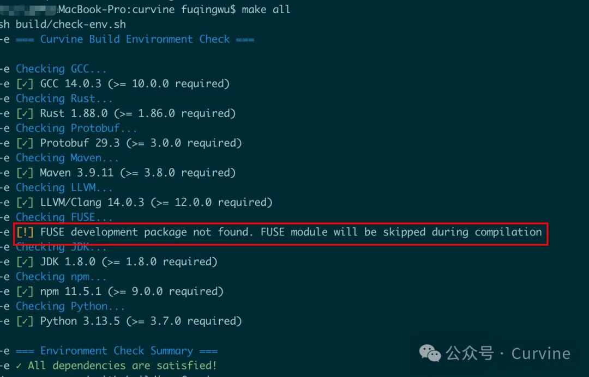

# 从0到1构建Curvine集群&FIO测试


如何快速上手试试Curvine的效果？这篇文章将介绍如何从0到1构建一个本地小集群，让大家快速上手。


> github： https://github.com/CurvineIO/curvine

----

## 1. 下载代码：
```bash
git clone https://github.com/CurvineIO/curvine.git
```

## 2.环境要求：
```bash
GCC: version 10 or later 
Rust: version 1.86 or later 
Protobuf: version 3.x
Maven: version 3.8 or later
LLVM: version 12 or later
FUSE: libfuse2 or libfuse3 development packages
JDK: version 1.8 or later 
npm: version 9 or later
Python: version 3.7 or later 
```

参考

## 3. 编译&&运行
```bash
make all
```

为方便大家编译，我们做编译脚本里会提前做依赖组件检查，对于MacOS系统的用户，暂时会选择跳过FUSE的编译（目前没适配mac系统）。 感兴趣的朋友可以考虑使用`macfuse`项目，进行适配。



## 4.编译完成，启动本地集群
```bash
cd build/dist
./bin/restart-all.sh
```

启动成功后，执行report命令，检查是否成功：
```bash

bin/cv report

       active_master: localhost:8995
       journal_nodes: 1,localhost:8996
            capacity: 233.5GB
           available: 105.0GB (44.99%)
             fs_used: 0.0B (0.00%)
         non_fs_used: 128.4GB
     live_worker_num: 1
     lost_worker_num: 0
           inode_num: 0
           block_num: 0
    live_worker_list: 192.168.xxx.xxx:8997,105.0GB/233.5GB (44.99%)
    lost_worker_list:
```

## 5. 查看本地master和worker的webui

```bash
http://localhost:9000/
http://localhost:9001/
```


## 6. FIO测试
测试环境：阿里云 `ecs.r8a.8xlarge` 机型 master/woker/client 各一台
- 32 核（vCPU）
- 256 GiB 内存  
- 系统盘 和 数据盘 均为：ESSD 云盘 500 GiB(7800 IOPS)
- 最大带宽：25Gb

准备数据（在worker机器）：

```bash
bin/curvine-bench.sh fuse.write
```

**fio顺序读测试，8并发**

```bash
fio -iodepth=1 -rw=read -ioengine=libaio -bs=256k
 -group_reporting -size=200gb 
 -filename=/curvine-fuse/fs-bench/0  
 -name=read_test --readonly -direct=1 --runtime=60 
 -numjobs=8
```


**fio随机读测试，8并发**
```bash

fio -iodepth=1 -rw=randread -ioengine=libaio -bs=256k
 -group_reporting -size=200gb 
 -filename=/curvine-fuse/fs-bench/0  
 -name=read_test --readonly -direct=1 --runtime=60
 -numjobs=8
```

最后，视频演示一下，做一下fio测试的效果：
