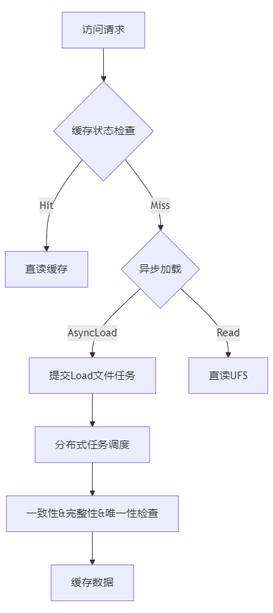
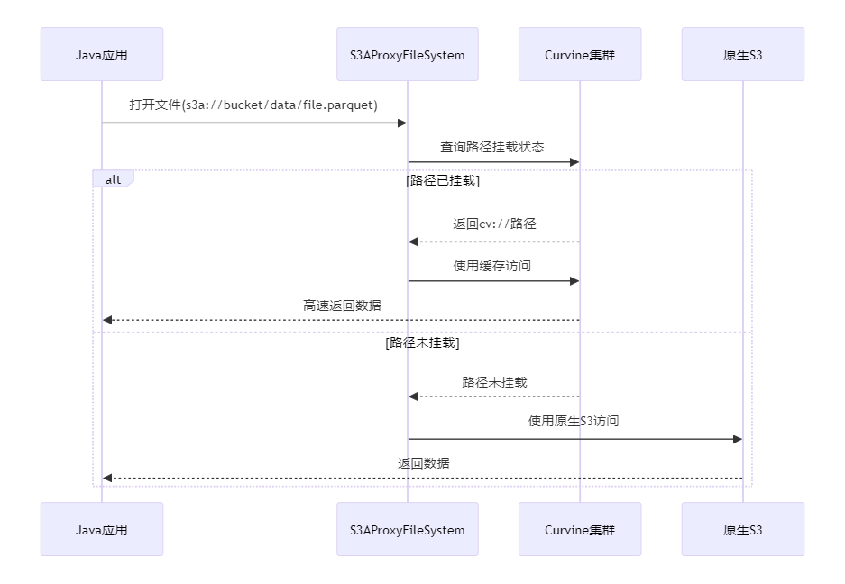
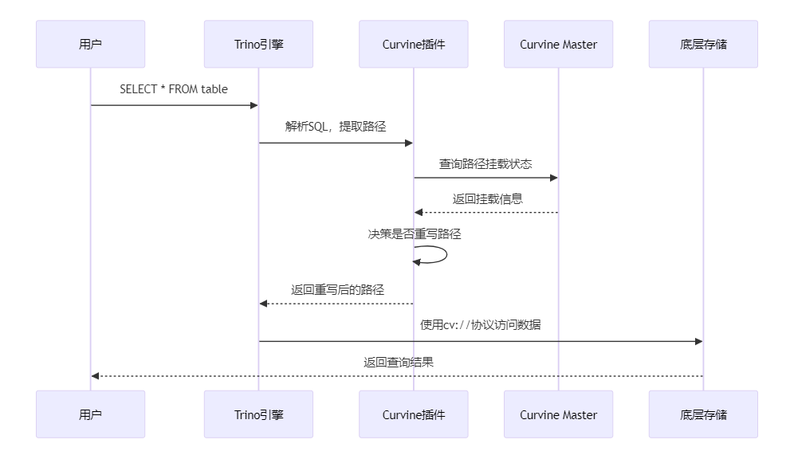

# Curvine 分布式缓存系统使用指南

[](https://github.com/curvine/curvine)
[](https://www.apache.org/licenses/LICENSE-2.0)
[](https://docs.curvine.io)

## 📚 目录

- [🎯 系统概述](#-系统概述)
- [📂 路径挂载管理](#-路径挂载管理)
- [💾 智能缓存策略](#-智能缓存策略)
- [🔄 数据一致性保障](#-数据一致性保障)
- [🤖 AI/ML 场景应用](#-aiml-场景应用)
- [🗄️ 大数据生态集成](#-大数据生态集成)
- [💡 最佳实践](#-最佳实践)
- [🎯 总结](#-总结)

---

## 🎯 系统概述

Curvine 是一个高性能、云原生的分布式缓存系统，专为现代数据密集型应用设计。它在底层存储（UFS）和计算引擎之间提供一个智能缓存层，显著提升数据访问性能。


### 🏆 性能优势

相比传统存储访问方式，Curvine 可以提供：

| 指标 | 云存储 | Curvine 缓存 | 性能提升 |
|------|----------|--------------|----------|
| **读取延迟** | 100-500ms | 1-10ms | **10-50x** |
| **吞吐量** | 100-500 MB/s | 1-10 GB/s | **10-20x** |
| **IOPS** | 1K-10K | 100K-1M | **100x** |
| **并发连接** | 100-1K | 10K-100K | **100x** |

---

### 核心组件

- **Master 集群**: 元数据管理、缓存调度、一致性保障
- **Worker 节点**: 数据缓存、I/O 处理、任务执行
- **Client SDK**: 多语言客户端，支持Rust、Fuse、Java、Python
- **Job Manager**: 分布式任务调度和管理
- **Metrics 系统**: 实时监控和性能分析

---


## 📂 路径挂载管理

挂载是使用 Curvine 缓存的第一步，它建立了底层存储（UFS）与缓存路径的映射关系。

### 挂载模式详解

Curvine 支持两种灵活的挂载模式：

#### 🎯 CST 模式（一致路径模式）
```bash
# 路径保持一致，便于管理和维护
bin/cv mount s3://bucket/data /bucket/data --mnt-type cst
```

**适用场景**: 
- 路径结构清晰的数据湖场景
- 需要直观路径映射的生产环境
- 多团队协作的数据平台

#### 🔀 Arch 模式（编排模式）
```bash
# 灵活路径映射，支持复杂的路径变换
bin/cv mount s3://complex-bucket/deep/nested/path /simple/data --mnt-type arch
```

**适用场景**:
- 复杂的存储层次结构
- 需要路径抽象的场景
- 多云存储统一访问

### 完整挂载示例

```bash
# 挂载 S3 存储到 Curvine（生产级配置）
bin/cv mount \
s3://bucket/warehouse/tpch_500g.db/orders \
/bucket/warehouse/tpch_500g.db/orders \
--ttl-ms 24h \
--ttl-action delete \
--replicas 3 \
--block-size 128MB \
--consistency-strategy always \
--storage-type ssd \
-c s3.endpoint_url=https://s3.ap-southeast-1.amazonaws.com \
-c s3.credentials.access=access_key \
-c s3.credentials.secret=secret_key \
-c s3.region_name=ap-southeast-1 
```

### 挂载参数详解

| 参数 | 类型 | 默认值 | 说明 | 示例 |
|------|------|--------|------|------|
| `--ttl-ms` | duration | `0` | 缓存数据过期时间 | `24h`, `7d`, `30d` |
| `--ttl-action` | enum | `none` | 过期策略：`delete`/`none` | `delete` |
| `--replicas` | int | `1` | 数据副本数（1-5） | `3` |
| `--block-size` | size | `128MB` | 缓存块大小 | `64MB`, `128MB`, `256MB` |
| `--consistency-strategy` | enum | `always` | 一致性策略 | `none`/`always`/`period` |
| `--storage-type` | enum | `disk` | 存储介质类型 | `mem`/`ssd`/`disk` |

### 挂载点管理

```bash
# 查看所有挂载点
bin/cv mount

# 卸载路径
bin/cv unmount /bucket/warehouse/tpch_500g.db/orders
```

---

## 💾 智能缓存策略

Curvine 提供多种智能缓存策略，从被动响应到主动预测，全方位优化数据访问性能。

### 主动数据预加载

主动加载让您可以在业务高峰前预热缓存，确保最佳性能：

```bash
# 基础加载
bin/cv load s3:/bucket/warehouse/critical-dataset

# 带进度监控的同步加载
bin/cv load s3:/bucket/warehouse/critical-dataset -w

```

### 自动缓存策略

Curvine 的自动缓存系统相比传统方案具有显著优势：

#### ✨ Curvine 智能缓存架构



#### 核心优势对比

| 特性 | 开源竞品 | Curvine | 优势说明 |
|------|----------|---------|----------|
| **加载粒度** | Block级别 | File/Directory级别 | 避免碎片化，保证完整性 |
| **重复处理** | 存在重复加载 | 智能去重 | 节省带宽和存储资源 |
| **任务调度** | 简单队列 | 分布式Job Manager | 高效并发，负载均衡 |
| **一致性保障** | 被动检查 | 主动感知 | 实时数据同步 |

---

## 🔄 数据一致性保障

数据一致性是缓存系统的核心挑战，Curvine 提供多层次的一致性保障机制。

### 一致性策略详解

#### 1. 🚫 None 模式 - 最高性能
```bash
bin/cv mount s3://bucket/path /bucket/path --consistency-strategy=none
```
- **适用场景**: 静态数据、归档数据、只读数据集
- **性能**: ⭐⭐⭐⭐⭐ (最快)
- **一致性**: ⭐⭐ (依赖TTL)

#### 2. ✅ Always 模式 - 强一致性
```bash
bin/cv mount s3://bucket/path /bucket/path --consistency-strategy=always
```
- **适用场景**: 经常更新的业务数据、关键业务系统
- **性能**: ⭐⭐⭐ (有开销)
- **一致性**: ⭐⭐⭐⭐⭐ (强一致性)

#### 3. 🕰️ Period 模式 - 平衡方案
```bash
bin/cv mount s3://bucket/path /bucket/path \
  --consistency-strategy=period \
  --check-interval=5m
```
- **适用场景**: 更新频率可预期的数据
- **性能**: ⭐⭐⭐⭐ (较好)
- **一致性**: ⭐⭐⭐⭐ (定期保证)

### 缓存性能监控

监控缓存命中率是评估一致性策略效果的重要手段：

```bash
# 获取缓存命中率
curl -s http://master:9001/metrics | grep -E "(cache_hits|cache_misses)"
```

```prometheus
client_mount_cache_hits{id="3108497238"} 823307
client_mount_cache_misses{id="3108497238"} 4380
```

---

## 🤖 AI/ML 场景应用

AI 和机器学习工作负载对存储性能有极高要求，Curvine 为此提供了专门优化的功能。

### 深度学习训练优化

```bash
# 为 GPU 集群优化的数据加载
bin/cv mount s3://datasets/imagenet /datasets/imagenet \
  --storage-type=mem \
  --block-size=1GB \
  --replicas=2 \

```

### 模型服务场景

```bash
# 模型文件缓存（低延迟访问）
bin/cv mount s3://model/bert-large /models/bert-large \
  --storage-type=mem \
  --ttl-ms=none \
  --consistency-strategy=always \

# 推理数据缓存
bin/cv mount s3://inference/input /inference/input \
  --storage-type=ssd \
  --ttl-ms=1h \
  --consistency-strategy=none 
```


### 🔗 POSIX 语义与 FUSE 访问

Curvine 完美支持 POSIX 语义，通过 FUSE（Filesystem in Userspace）接口，可以将 Curvine 集群挂载为本地文件系统，为 AI/ML 应用提供透明的文件访问体验。


#### AI/ML 训练中的 FUSE 使用

##### 1. 深度学习训练数据访问

```python
# PyTorch 训练脚本
import torch
from torch.utils.data import Dataset, DataLoader
from torchvision import transforms
from PIL import Image
import os

class CurvineImageDataset(Dataset):
    def __init__(self, root_dir, transform=None):
        """
        通过 FUSE 挂载点直接访问 Curvine 中的数据
        root_dir: FUSE 挂载点路径，如 /curvine-fuse/datasets/imagenet
        """
        self.root_dir = root_dir
        self.transform = transform
        self.image_paths = []
        
        # 直接遍历 FUSE 挂载的目录
        for class_dir in os.listdir(root_dir):
            class_path = os.path.join(root_dir, class_dir)
            if os.path.isdir(class_path):
                for img_file in os.listdir(class_path):
                    if img_file.lower().endswith(('.png', '.jpg', '.jpeg')):
                        self.image_paths.append(os.path.join(class_path, img_file))
    
    def __len__(self):
        return len(self.image_paths)
    
    def __getitem__(self, idx):
        # 通过标准文件操作访问数据，享受 Curvine 缓存加速
        img_path = self.image_paths[idx]
        image = Image.open(img_path).convert('RGB')
        
        if self.transform:
            image = self.transform(image)
            
        # 从路径提取标签
        label = os.path.basename(os.path.dirname(img_path))
        return image, label

# 使用示例
transform = transforms.Compose([
    transforms.Resize((224, 224)),
    transforms.ToTensor(),
    transforms.Normalize(mean=[0.485, 0.456, 0.406], 
                        std=[0.229, 0.224, 0.225])
])

# 直接使用 FUSE 挂载点的路径
dataset = CurvineImageDataset(
    root_dir='/curvine-fuse/datasets/imagenet/train',
    transform=transform
)

dataloader = DataLoader(
    dataset, 
    batch_size=64, 
    shuffle=True, 
    num_workers=8,
    pin_memory=True
)

# 训练循环
for epoch in range(num_epochs):
    for batch_idx, (data, targets) in enumerate(dataloader):
        # 数据通过 FUSE 自动从 Curvine 缓存加载
        # 享受接近内存的访问速度
        outputs = model(data.cuda())
        loss = criterion(outputs, targets.cuda())
        # ... 训练逻辑
```

##### 2. TensorFlow/Keras 数据管道

```python
import tensorflow as tf
import os

def create_curvine_dataset(data_dir, batch_size=32):
    """
    通过 FUSE 挂载点创建 TensorFlow 数据管道
    data_dir: FUSE 挂载的数据目录
    """
    
    # 直接使用标准文件 API 访问 FUSE 挂载的数据
    def load_and_preprocess_image(path):
        # TensorFlow 通过 FUSE 透明访问 Curvine 缓存
        image = tf.io.read_file(path)
        image = tf.image.decode_jpeg(image, channels=3)
        image = tf.image.resize(image, [224, 224])
        image = tf.cast(image, tf.float32) / 255.0
        return image
    
    # 扫描 FUSE 挂载目录中的文件
    image_paths = []
    labels = []
    
    for class_name in os.listdir(data_dir):
        class_dir = os.path.join(data_dir, class_name)
        if os.path.isdir(class_dir):
            for img_file in os.listdir(class_dir):
                if img_file.lower().endswith(('.png', '.jpg', '.jpeg')):
                    image_paths.append(os.path.join(class_dir, img_file))
                    labels.append(class_name)
    
    # 创建数据集
    path_ds = tf.data.Dataset.from_tensor_slices(image_paths)
    label_ds = tf.data.Dataset.from_tensor_slices(labels)
    
    # 应用预处理
    image_ds = path_ds.map(
        load_and_preprocess_image, 
        num_parallel_calls=tf.data.AUTOTUNE
    )
    
    # 组合数据和标签
    dataset = tf.data.Dataset.zip((image_ds, label_ds))
    
    return dataset.batch(batch_size).prefetch(tf.data.AUTOTUNE)

# 使用示例
train_dataset = create_curvine_dataset('/curvine-fuse/datasets/imagenet/train')
val_dataset = create_curvine_dataset('/curvine-fuse/datasets/imagenet/val')

# 模型训练
model.fit(
    train_dataset,
    validation_data=val_dataset,
    epochs=50,
    callbacks=[
        tf.keras.callbacks.ModelCheckpoint('/curvine-fuse/models/checkpoints/'),
        tf.keras.callbacks.TensorBoard(log_dir='/curvine-fuse/logs/')
    ]
)
```

---

## 🗄️ 大数据生态集成

Curvine 与主流大数据框架无缝集成，提供透明的缓存加速能力。

### Hadoop 生态集成

#### 基础配置

在 `hdfs-site.xml` 或 `core-site.xml` 中添加：

```xml
<!-- Curvine FileSystem 实现 -->
<property>
    <name>fs.cv.impl</name>
    <value>io.curvine.CurvineFileSystem</value>
</property>

<!-- 单集群配置 -->
<property>
    <name>fs.cv.master_addrs</name>
    <value>master1:8995,master2:8995,master3:8995</value>
</property>

```

#### 多集群支持

```xml
<!-- 集群1：生产环境 -->
<property>
    <name>fs.cv.production.master_addrs</name>
    <value>prod-master1:8995,prod-master2:8995,prod-master3:8995</value>
</property>

<!-- 集群2：开发环境 -->
<property>
    <name>fs.cv.development.master_addrs</name>
    <value>dev-master1:8995,dev-master2:8995</value>
</property>

<!-- 集群3：机器学习专用集群 -->
<property>
    <name>fs.cv.ml-cluster.master_addrs</name>
    <value>ml-master1:8995,ml-master2:8995,ml-master3:8995</value>
</property>
```


### 🔄 UFS透明代理

为了更好地支持现有Java应用无缝接入Curvine缓存，我们提供了UFS透明代理解决方案。该方案的核心优势是**零代码修改**，让现有应用可以立即享受Curvine的缓存加速效果。

#### ✨ 透明代理核心特性

- **🚫 零代码修改**: 保留原有所有接口不变，业务代码无需任何修改
- **🔍 智能路径识别**: 仅在文件打开时判断路径是否已挂载到Curvine
- **⚡ 自动缓存加速**: 已挂载路径自动启用缓存加速，未挂载路径走原生S3访问
- **🔄 平滑切换**: 支持在运行时动态切换是否使用缓存，无需重启应用

#### 🛠️ 配置方式

只需要替换Hadoop配置中的S3FileSystem实现类：

```xml
<!-- 传统S3访问配置 -->
<!--
<property>
    <name>fs.s3a.impl</name>
    <value>org.apache.hadoop.fs.s3a.S3AFileSystem</value>
</property>
-->

<!-- 替换为Curvine透明代理 -->
<property>
    <name>fs.s3a.impl</name>
    <value>io.curvine.S3AProxyFileSystem</value>
</property>

<property>
    <name>fs.cv.impl</name>
    <value>io.curvine.CurvineFileSystem</value>
</property>

<!-- Curvine集群配置 -->
<property>
    <name>fs.curvine.master_addrs</name>
    <value>master1:8995,master2:8995,master3:8995</value>
</property>

```

#### 🔧 工作原理



#### 🚀 使用示例

**无需修改任何业务代码，原有代码直接享受加速：**

```java
// 业务代码完全不变！
Configuration conf = new Configuration();
FileSystem fs = FileSystem.get(URI.create("s3a://my-bucket/"), conf);

// 这个路径如果已挂载到Curvine，自动享受缓存加速
FSDataInputStream input = fs.open(new Path("s3a://my-bucket/warehouse/data.parquet"));

// 这个路径如果未挂载，走原生S3访问
FSDataInputStream input2 = fs.open(new Path("s3a://my-bucket/archive/old-data.parquet"));
```

**Spark/MapReduce代码示例：**

```java
// Spark代码无需任何修改
Dataset<Row> df = spark.read()
    .option("header", "true")
    // 如果/warehouse/路径已挂载，自动使用缓存加速
    .csv("s3a://data-lake/warehouse/customer_data/");
    
df.groupBy("region")
  .agg(sum("revenue").alias("total_revenue"))
  .orderBy(desc("total_revenue"))
  .show(20);
```

**Python PySpark示例：**

```python
# Python代码也无需修改
from pyspark.sql import SparkSession
from pyspark.sql.functions import sum, desc

spark = SparkSession.builder.appName("TransparentCache").getOrCreate()

# 自动判断是否使用缓存
df = spark.read \
    .option("header", "true") \
    .csv("s3a://data-lake/analytics/events/")

result = df.groupBy("event_type") \
    .agg(sum("count").alias("total_events")) \
    .orderBy(desc("total_events"))
    
result.show()
```

### Apache Spark 优化配置

```bash
# Spark 应用启动配置
spark-submit \
  --class com.example.SparkApp \
  --master yarn \
  --deploy-mode cluster \
  --conf spark.hadoop.fs.cv.impl=io.curvine.CurvineFileSystem \
  --conf spark.hadoop.fs.cv.master_addrs=master1:8995,master2:8995,master3:8995 \
  --conf spark.sql.adaptive.enabled=true \
  --jars curvine-hadoop-client.jar \
  app.jar
```

#### Spark 代码示例

```scala
// Scala 示例
val spark = SparkSession.builder()
  .appName("Curvine Demo")
  .config("spark.hadoop.fs.cv.impl", "io.curvine.CurvineFileSystem")
  .getOrCreate()

// 直接使用 cv:// 协议访问缓存数据
val df = spark.read
  .option("multiline", "true")
  .json("cv://production/warehouse/events/2024/01/01/")

df.groupBy("event_type")
  .count()
  .show()

// 多集群访问
val prodData = spark.read.parquet("cv://production/warehouse/sales/")
val mlData = spark.read.parquet("cv://ml-cluster/features/user_profiles/")
```

```python
# Python 示例
from pyspark.sql import SparkSession

spark = SparkSession.builder \
    .appName("Curvine Python Demo") \
    .config("spark.hadoop.fs.cv.impl", "io.curvine.CurvineFileSystem") \
    .config("spark.hadoop.fs.cv.master_addrs", "master1:8995,master2:8995") \
    .getOrCreate()

# 读取缓存中的数据
df = spark.read.option("header", "true") \
    .csv("cv://warehouse/customer_data/")

# 复杂查询自动享受缓存加速
result = df.groupBy("region") \
    .agg({"revenue": "sum", "orders": "count"}) \
    .orderBy("sum(revenue)", ascending=False)

result.show(20)
```

### Trino/Presto 插件集成

Curvine 提供了智能路径替换插件，可以做到无侵入性实现缓存加速，不需要业务修改代码，实现完全透明的缓存加速：

#### 插件工作流程



spark 插件使用实例：
```
spark-submit \
--class main.scala.Tpch \
--name tpch_demo \
--conf spark.hadoop.fs.cv.impl=io.curvine.CurvineFileSystem \
--conf spark.hadoop.fs.cv.default.master_addrs=master1:8995,master2:8995 \
--conf spark.sql.extensions=io.curvine.spark.CurvineSparkExtension \
```

### Flink 实时计算集成

```java
// Flink Table API 集成示例
TableEnvironment tableEnv = TableEnvironment.create(settings);

// 配置 Curvine FileSystem
Configuration config = new Configuration();
config.setString("fs.cv.impl", "io.curvine.CurvineFileSystem");
config.setString("fs.cv.master_addrs", "master1:8995,master2:8995");

// 创建 Curvine 表
tableEnv.executeSql(
    "CREATE TABLE user_events (" +
    "  user_id BIGINT," +
    "  event_type STRING," +
    "  timestamp_ms BIGINT," +
    "  properties MAP<STRING, STRING>" +
    ") WITH (" +
    "  'connector' = 'filesystem'," +
    "  'path' = 'cv://streaming/events/'," +
    "  'format' = 'json'" +
    ")"
);

// 实时查询享受缓存加速
Table result = tableEnv.sqlQuery(
    "SELECT user_id, COUNT(*) as event_count " +
    "FROM user_events " +
    "WHERE timestamp_ms > UNIX_TIMESTAMP() * 1000 - 3600000 " +
    "GROUP BY user_id"
);
```

---


---

## 💡 最佳实践

### 🎯 挂载策略最佳实践

#### 按业务场景分层挂载

```bash
# 热数据：高频访问，使用内存缓存
bin/cv mount s3://bucket/hot /bucket/hot \
  --storage-type=mem \
  --replicas=3 \
  --ttl-ms=1d \
  --ttl-action=delete

# 温数据：定期访问，使用 SSD 缓存
bin/cv mount s3://bucket/warm /bucket/warm \
  --storage-type=ssd \
  --replicas=2 \
  --ttl-ms=7d \
  --ttl-action=delete


# 冷数据：低频访问，使用磁盘缓存
bin/cv mount s3://bucket/cold /bucket/cold \
  --storage-type=disk \
  --replicas=1 \
  --ttl-ms=30d \
  --ttl-action=delete
```

#### 按数据类型优化

```bash
# 小文件密集型（如日志、配置）
bin/cv mount s3://bucket/logs /bucket/logs \
  --block-size=4MB \
  --consistency-strategy=none \

# 大文件型（如视频、模型）
bin/cv mount s3://bucket/models /bucket/models \
  --block-size=1GB \
  --consistency-strategy=always \

# 分析型数据（如 Parquet）
bin/cv mount s3://bucket/analytics /bucket/analytics \
  --block-size=128MB \
  --consistency-strategy=none \
```
---

## 🎯 总结

Curvine 作为新一代分布式缓存系统，通过智能缓存策略、强一致性保障和无缝生态集成，为现代数据密集型应用提供了卓越的性能提升。

### 🏆 核心价值

- **🚀 性能提升**: 10-100倍的访问加速，显著降低数据访问延迟
- **💰 成本优化**: 减少云存储访问费用，提高计算资源利用率  
- **🛡️ 数据安全**: 多重一致性保障，确保数据准确性和完整性
- **🌐 生态友好**: 与主流大数据和 AI 框架无缝集成

---

*Curvine - 让数据访问快如闪电 ⚡*
