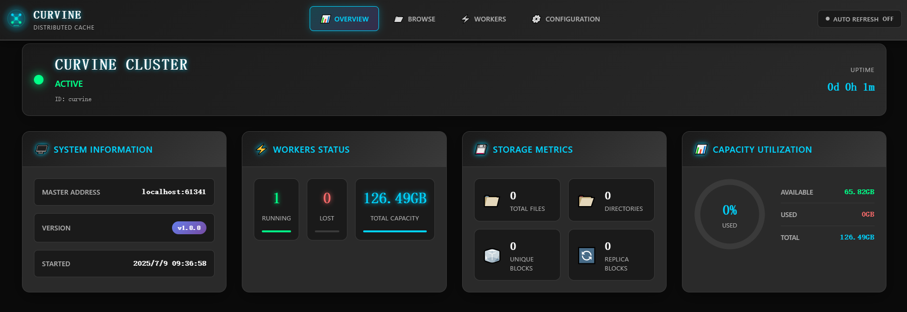
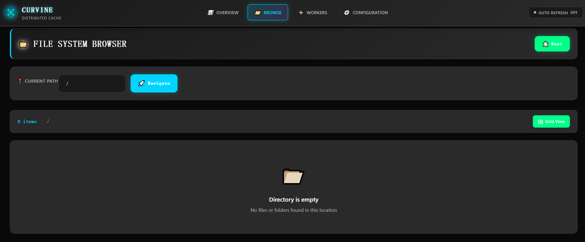
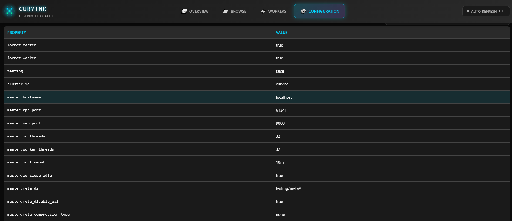

# Web管理界面

Curvine 提供了直观易用的Web管理界面，用户可以通过浏览器实时监控集群状态、管理文件系统、查看工作节点信息以及配置系统参数。Web界面为集群运维和日常管理提供了可视化的操作平台，无需复杂的命令行操作即可完成大部分管理任务。

## Overview - 集群概览

Overview页面提供了Curvine集群的整体运行状态概览，是集群监控的核心仪表板。

### 集群状态信息
- **集群状态**：显示当前集群是否处于活跃状态，包含运行时长信息
- **主节点地址**：显示Master节点的访问地址和端口
- **版本信息**：显示当前运行的Curvine版本号
- **启动时间**：显示集群的启动时间戳

### 工作节点状态
- **活跃工作节点数量**：实时显示当前在线的Worker节点数量
- **离线工作节点数量**：显示当前离线或故障的Worker节点数量
- **节点状态指示器**：通过颜色编码直观显示节点健康状态

### 存储容量统计
- **总存储容量**：显示集群的总存储容量
- **已用存储空间**：显示当前已使用的存储空间
- **可用存储空间**：显示剩余可用的存储空间
- **容量利用率**：通过进度条和百分比显示存储使用率

### 文件系统统计
- **总文件数量**：显示文件系统中的文件总数
- **目录数量**：显示文件系统中的目录总数
- **数据块统计**：显示唯一数据块和副本数据块的数量

通过Overview页面，管理员可以快速了解集群的整体健康状况，及时发现潜在问题并进行相应处理。

## Browse - 文件系统浏览

Browse页面提供了类似文件管理器的界面，用户可以浏览和管理Curvine文件系统中的文件和目录。

### 文件系统导航
- **路径导航栏**：显示当前所在的文件系统路径，支持快速跳转
- **导航按钮**：提供"Navigate"按钮用于路径跳转
- **面包屑导航**：显示完整的目录层级结构

### 文件和目录管理
- **文件列表视图**：以列表形式展示当前目录下的文件和子目录
- **文件详细信息**：显示文件大小、修改时间、权限等属性信息
- **目录操作**：支持创建新目录、删除目录等操作
- **文件操作**：支持文件的查看、下载、删除等基本操作

### 存储统计
- **目录项统计**：显示当前目录下的文件和子目录数量
- **Grid View按钮**：提供网格视图切换选项，方便不同的浏览需求

### 空目录提示
当目录为空时，界面会显示友好的提示信息："Directory is empty - No files or folders found in this location"，帮助用户理解当前状态。

Browse页面使用户能够直观地管理分布式文件系统，就像操作本地文件系统一样简单便捷。

## Workers - 工作节点管理

Workers页面专门用于监控和管理集群中的工作节点，提供详细的节点状态信息和性能指标。

### 实时节点状态
- **总容量显示**：显示所有工作节点的总存储容量
- **可用容量显示**：显示当前可用的存储容量
- **容量统计**：实时更新的容量使用情况

### 活跃工作节点列表
对于每个在线的工作节点，显示以下详细信息：
- **节点ID**：唯一标识工作节点的ID号
- **IP地址**：工作节点的网络地址
- **最后心跳时间**：显示节点最后一次与Master通信的时间
- **节点容量信息**：
  - 总容量：节点的总存储容量
  - 可用容量：节点当前可用的存储空间
  - 已用容量：节点当前已使用的存储空间
- **使用率指示器**：通过进度条直观显示节点的存储使用率

### 离线节点监控
- **离线节点列表**：显示当前离线或无响应的工作节点
- **故障检测**：帮助管理员快速识别有问题的节点
- **节点恢复状态**：跟踪离线节点的恢复情况

### 集群健康监控
通过Workers页面，管理员可以：
- 监控各个节点的健康状态和性能表现
- 及时发现存储容量不足或节点故障问题
- 评估集群的负载分布和资源利用情况
- 为集群扩容或维护提供决策依据

## Configuration - 系统配置

Configuration页面提供了Curvine集群的详细配置信息查看功能，帮助管理员了解和验证系统配置。

### 配置参数部分展示
页面以表格形式展示所有重要的系统配置参数：

#### 格式化配置
- **format_master**：Master节点格式化状态
- **format_worker**：Worker节点格式化状态

#### 测试和调试配置
- **testing**：测试模式开关状态

#### 集群标识
- **cluster_id**：集群的唯一标识符

#### 网络配置
- **master_hostname**：Master节点的主机名
- **master_rpc_port**：Master节点RPC服务端口
- **master_web_port**：Master节点Web服务端口

#### 性能调优参数
- **master_io_threads**：Master节点IO线程数
- **master_worker_threads**：Master节点工作线程数
- **master_io_timeout**：Master节点IO超时时间
- **master_io_close_idle**：Master节点空闲连接关闭配置

#### 元数据管理
- **master_meta_dir**：Master节点元数据存储目录
- **master_meta_disable_wal**：元数据WAL日志开关
- **master_meta_compression_type**：元数据压缩类型

### 配置验证和诊断
通过Configuration页面，管理员可以：
- **验证配置正确性**：确认各项配置参数是否符合预期
- **性能调优参考**：根据当前配置评估性能优化空间
- **故障诊断支持**：在出现问题时快速检查相关配置
- **集群对比**：对比不同环境的配置差异

### 配置管理最佳实践
- 定期检查关键配置参数，确保与业务需求匹配
- 在进行性能调优前，记录当前配置作为基线
- 配置变更后，通过此页面验证变更是否生效
- 结合性能监控数据，优化线程数、超时时间等参数

通过Web管理界面，Curvine为用户提供了完整的集群管理和监控能力，大大简化了分布式缓存系统的运维工作，提高了管理效率和系统可观测性。