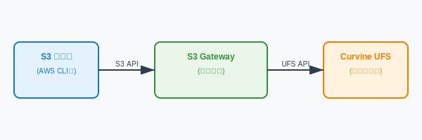

# S3 对象存储网关

## 概述

Curvine S3 对象存储网关是一个高性能、企业级的 S3 兼容网关，为 Curvine 分布式文件缓存系统提供标准的 AWS S3 API 访问能力。通过这个网关，用户可以使用任何支持 S3 协议的工具和应用程序来访问 Curvine 存储的数据。

### 主要特性

- **完全兼容 S3 API**：支持所有常用的 S3 操作，包括对象和存储桶管理
- **高性能架构**：基于 Rust 和 Axum 构建，支持异步高吞吐量处理
- **企业级安全**：支持 AWS Signature V2/V4 认证，完整的权限控制
- **灵活部署**：支持独立部署
- **流式传输**：内存高效的大文件处理
- **Range 请求**：支持 HTTP Range 请求和部分内容下载
- **多部分上传**：支持大文件分块上传
- **负载均衡**：支持多实例部署提升性能

### 架构说明

S3 网关作为 Curvine 系统的前端接口，将标准的 S3 API 请求转换为 Curvine 文件系统操作：



## 支持的 S3 操作

### 对象操作
- `PutObject` - 上传对象
- `GetObject` - 下载对象
- `HeadObject` - 获取对象元数据
- `DeleteObject` - 删除对象
- `CopyObject` - 复制对象（规划中）

### 存储桶操作
- `CreateBucket` - 创建存储桶
- `DeleteBucket` - 删除存储桶
- `HeadBucket` - 检查存储桶是否存在
- `ListObjects` - 列出存储桶中的对象
- `GetBucketLocation` - 获取存储桶位置

### 高级功能
- **Range 请求**：支持 HTTP Range 头进行部分内容下载
- **多部分上传**：支持大文件分块上传
- **流式传输**：内存高效的大文件传输

## 服务管理

S3 网关提供了便捷的服务管理脚本，位于 `build/bin/curvine-s3-gateway.sh`。

### 启动服务

```bash
# 使用默认配置启动
./build/bin/curvine-s3-gateway.sh start

# 指定配置文件启动
./build/bin/curvine-s3-gateway.sh start --conf /path/to/curvine-cluster.toml

# 指定监听地址和区域
./build/bin/curvine-s3-gateway.sh start \
    --listen 0.0.0.0:9000 \
    --region us-west-2
```

### 停止服务

```bash
# 优雅停止服务
./build/bin/curvine-s3-gateway.sh stop
```

### 查看服务状态

```bash
# 查看服务运行状态
./build/bin/curvine-s3-gateway.sh status
```

### 重启服务

```bash
# 重启服务
./build/bin/curvine-s3-gateway.sh restart
```

### 查看日志

```bash
# 查看实时日志
tail -f ${CURVINE_HOME}/logs/curvine-s3-gateway.out

# 查看最近的日志
tail -100 ${CURVINE_HOME}/logs/curvine-s3-gateway.out
```

## 启动参数

### 命令行参数

| 参数 | 描述 | 默认值 | 示例 |
|------|------|--------|------|
| `--conf` | 配置文件路径 | `${CURVINE_HOME}/conf/curvine-cluster.toml` | `--conf /etc/curvine.toml` |
| `--listen` | 监听地址和端口 | `0.0.0.0:9900` | `--listen 127.0.0.1:9000` |
| `--region` | S3 区域标识 | `us-east-1` | `--region us-west-2` |

### 配置文件参数

在 `curvine-cluster.toml` 中的 `[s3_gateway]` 部分支持以下配置参数：

| 参数名 | 类型 | 默认值 | 描述 |
|--------|------|--------|------|
| `listen` | string | `"0.0.0.0:9900"` | S3 网关监听地址和端口 |
| `region` | string | `"us-east-1"` | S3 区域标识符 |
| `put_temp_dir` | string | `"/tmp/curvine-temp"` | PUT 操作临时目录（包括多部分上传和常规上传） |
| `put_memory_buffer_threshold` | integer | `1048576` | 小文件内存缓冲区阈值（字节，默认 1MB） |
| `put_max_memory_buffer` | integer | `16777216` | 最大内存缓冲区大小（字节，默认 16MB） |
| `get_chunk_size_mb` | float | `1.0` | GET 操作读写块大小（MB，可选：0.5/1/2） |
| `enable_distributed_auth` | boolean | `false` | 启用分布式认证 |
| `credentials_path` | string | 见说明 | 凭据文件路径，根据认证模式决定 |
| `cache_refresh_interval_secs` | integer | `30` | 缓存刷新间隔（秒） |

**凭据路径说明：**

`credentials_path` 参数的值根据 `enable_distributed_auth` 设置决定：

- **本地认证模式**（`enable_distributed_auth = false`）：
  - 默认路径：`~/.curvine/credentials.jsonl`
  - 凭据存储在本地文件系统

- **分布式认证模式**（`enable_distributed_auth = true`）：
  - 默认路径：`/system/auth/credentials.jsonl`
  - 凭据存储在 Curvine 分布式文件系统中

**配置示例：**

```toml
[s3_gateway]
# S3 网关监听地址（主机:端口）
listen = "0.0.0.0:9900"

# S3 区域
region = "us-east-1"

# 所有 PUT 操作的临时目录（多部分上传和常规上传）
put_temp_dir = "/tmp/curvine-temp"

# 小文件内存缓冲区阈值（字节，默认：1MB）
put_memory_buffer_threshold = 1048576

# 最大内存缓冲区大小（字节，默认：16MB）
put_max_memory_buffer = 16777216

# GET 性能优化设置
# GET 读写块大小（MB，默认：1.0，选项：0.5/1/2）
get_chunk_size_mb = 1.0

# 认证模式配置
# 本地认证模式（默认）
enable_distributed_auth = false
credentials_path = "~/.curvine/credentials.jsonl"

# 分布式认证模式（可选）
# enable_distributed_auth = true
# credentials_path = "/system/auth/credentials.jsonl"

# 缓存刷新间隔（秒）
cache_refresh_interval_secs = 30
```

### 环境变量

| 变量名 | 描述 | 说明 |
|--------|------|------|
| `AWS_ACCESS_KEY_ID` 或 `S3_ACCESS_KEY` | S3 访问密钥 | 启动时从环境变量读取，无默认值 |
| `AWS_SECRET_ACCESS_KEY` 或 `S3_SECRET_KEY` | S3 密钥 | 启动时从环境变量读取，无默认值 |
| `RUST_LOG` | 日志级别 | 默认 `info`，可设置 `debug`、`trace` 等 |

**凭据环境变量说明：**

网关启动时会自动读取以下环境变量作为默认凭据：

```bash
# 设置访问密钥（两种方式任选其一）
export AWS_ACCESS_KEY_ID="your-access-key"
# 或者
export S3_ACCESS_KEY="your-access-key"

# 设置密钥（两种方式任选其一）
export AWS_SECRET_ACCESS_KEY="your-secret-key"
# 或者
export S3_SECRET_KEY="your-secret-key"
```

如果设置了这些环境变量，网关启动时会自动将这些凭据添加到凭据存储中，无需手动配置。

## 凭据管理

S3 网关提供了完整的凭据管理功能，支持添加、生成、列出和管理访问凭据。

### 添加凭据

```bash
# 添加新的访问凭据
./build/bin/curvine-s3-gateway.sh credential add \
    --access-key AKIAEXAMPLEKEY123 \
    --secret-key wJalrXUtnFEMI/K7MDENG/bPxRfiCYEXAMPLEKEY \
    --description "生产环境访问密钥"
```

### 生成随机凭据

```bash
# 生成新的随机凭据
./build/bin/curvine-s3-gateway.sh credential generate \
    --description "自动生成的测试密钥"
```

### 列出凭据

```bash
# 列出所有凭据（隐藏密钥）
./build/bin/curvine-s3-gateway.sh credential list

# 显示完整凭据信息（包含密钥）
./build/bin/curvine-s3-gateway.sh credential list --show-secrets
```

### 查看缓存统计

```bash
# 查看凭据缓存统计信息
./build/bin/curvine-s3-gateway.sh credential stats
```

### 凭据存储

凭据以 JSONL 格式存储：

- **本地模式**：`~/.curvine/credentials.jsonl`
- **分布式模式**：`/system/auth/credentials.jsonl`

每个凭据条目包含：
```json
{
  "access_key": "AKIAEXAMPLEKEY123",
  "secret_key": "wJalrXUtnFEMI/K7MDENG/bPxRfiCYEXAMPLEKEY",
  "created_at": 1640995200,
  "enabled": true,
  "description": "生产环境访问密钥"
}
```

## 使用示例

### AWS CLI

```bash
# 配置环境变量
export AWS_ACCESS_KEY_ID=AqU4axe4feDyIielarPI
export AWS_SECRET_ACCESS_KEY=0CJZ2QfHi2tDb4DKuCJ2vnBEUXg5EYQt
export AWS_DEFAULT_REGION=us-east-1

# 创建存储桶
aws s3 mb s3://my-bucket --endpoint-url http://localhost:9900

# 上传文件
aws s3 cp /path/to/local/file.txt s3://my-bucket/ --endpoint-url http://localhost:9900

# 下载文件
aws s3 cp s3://my-bucket/file.txt /tmp/ --endpoint-url http://localhost:9900

# 列出对象
aws s3 ls s3://my-bucket/ --endpoint-url http://localhost:9900

# 删除对象
aws s3 rm s3://my-bucket/file.txt --endpoint-url http://localhost:9900

# 同步目录
aws s3 sync /local/directory s3://my-bucket/prefix/ --endpoint-url http://localhost:9900
```

### MinIO 客户端 (mc)

```bash
# 配置 MinIO 客户端
mc alias set curvine http://localhost:9900 AqU4axe4feDyIielarPI 0CJZ2QfHi2tDb4DKuCJ2vnBEUXg5EYQt

# 创建存储桶
mc mb curvine/my-bucket

# 上传文件
mc cp /path/to/file.txt curvine/my-bucket/

# 下载文件
mc cp curvine/my-bucket/file.txt /tmp/

# 列出内容
mc ls curvine/my-bucket/

# 镜像目录
mc mirror /local/directory curvine/my-bucket/prefix/
```

### Python boto3

```python
import boto3
from botocore.config import Config

# 创建 S3 客户端
s3_client = boto3.client(
    's3',
    endpoint_url='http://localhost:9900',
    aws_access_key_id='AqU4axe4feDyIielarPI',
    aws_secret_access_key='0CJZ2QfHi2tDb4DKuCJ2vnBEUXg5EYQt',
    region_name='us-east-1',
    config=Config(retries={'max_attempts': 3})
)

# 创建存储桶
s3_client.create_bucket(Bucket='my-python-bucket')

# 上传文件
with open('local-file.txt', 'rb') as f:
    s3_client.put_object(Bucket='my-python-bucket', Key='remote-file.txt', Body=f)

# 下载文件
response = s3_client.get_object(Bucket='my-python-bucket', Key='remote-file.txt')
data = response['Body'].read()

# 列出对象
response = s3_client.list_objects_v2(Bucket='my-python-bucket')
for obj in response.get('Contents', []):
    print(f"对象: {obj['Key']}, 大小: {obj['Size']}")
```

### Range 请求示例

```bash
# 获取文件的前 1000 字节
curl -H "Range: bytes=0-999" \
     -H "Authorization: AWS4-HMAC-SHA256 ..." \
     http://localhost:9900/my-bucket/large-file.txt

# 获取文件的最后 1000 字节
curl -H "Range: bytes=-1000" \
     -H "Authorization: AWS4-HMAC-SHA256 ..." \
     http://localhost:9900/my-bucket/large-file.txt
```

## 多实例部署

为了提高性能和可用性，可以部署多个 S3 网关实例。

> **注意**：目前 S3 网关采用中心式部署模式。随 Worker 启动的非中心式网关能力正在开发中，未来将支持更加分布式的部署架构。

### 负载均衡配置

#### 使用 Nginx

```nginx
upstream s3_gateway {
    server 192.168.1.10:9900 weight=1;
    server 192.168.1.11:9900 weight=1;
    server 192.168.1.12:9900 weight=1;
}

server {
    listen 80;
    server_name s3-gateway.example.com;
    
    location / {
        proxy_pass http://s3_gateway;
        proxy_set_header Host $host;
        proxy_set_header X-Real-IP $remote_addr;
        proxy_set_header X-Forwarded-For $proxy_add_x_forwarded_for;
        
        # S3 特定配置
        proxy_buffering off;
        proxy_request_buffering off;
        client_max_body_size 0;
    }
}
```

#### 使用 HAProxy

```haproxy
backend s3_gateway
    balance roundrobin
    option httpchk GET /healthz
    server gateway1 192.168.1.10:9900 check
    server gateway2 192.168.1.11:9900 check
    server gateway3 192.168.1.12:9900 check

frontend s3_frontend
    bind *:80
    default_backend s3_gateway
```

### 多实例启动

在每个节点上启动网关实例：

```bash
# 节点 1
./build/bin/curvine-s3-gateway.sh start \
    --conf /etc/curvine-cluster.toml \
    --listen 0.0.0.0:9900

# 节点 2  
./build/bin/curvine-s3-gateway.sh start \
    --conf /etc/curvine-cluster.toml \
    --listen 0.0.0.0:9900

# 节点 3
./build/bin/curvine-s3-gateway.sh start \
    --conf /etc/curvine-cluster.toml \
    --listen 0.0.0.0:9900
```

### 高可用配置

#### 配置共享存储

确保所有网关实例使用相同的 Curvine 集群配置：

```toml
[s3_gateway]
# 使用分布式认证确保凭据一致性
enable_distributed_auth = true
credentials_path = "/system/auth/credentials.jsonl"

# 共享多部分上传目录
multipart_temp = "/shared/curvine-multipart"
```

#### 健康检查

每个网关实例都提供健康检查端点：

```bash
# 检查网关健康状态
curl http://localhost:9900/healthz
```

### 性能优化

#### 系统级优化

```bash
# 增加文件描述符限制
ulimit -n 65536

# 优化网络参数
echo 'net.ipv4.tcp_keepalive_time = 600' >> /etc/sysctl.conf
echo 'net.core.rmem_max = 16777216' >> /etc/sysctl.conf
echo 'net.core.wmem_max = 16777216' >> /etc/sysctl.conf
sysctl -p
```

#### 配置调优

```toml
[s3_gateway]
# 优化缓存刷新间隔
cache_refresh_interval_secs = 60
```


## 故障排除

### 常见问题

1. **端口被占用**
   ```bash
   # 更换监听端口
   ./build/bin/curvine-s3-gateway.sh start --listen 0.0.0.0:9901
   ```

2. **认证失败**
   ```bash
   # 检查环境变量
   echo $AWS_ACCESS_KEY_ID
   echo $AWS_SECRET_ACCESS_KEY
   
   # 检查凭据存储中是否存在相应凭据
   ./build/bin/curvine-s3-gateway.sh credential list
   
   # 查看凭据存储路径和统计信息
   ./build/bin/curvine-s3-gateway.sh credential stats
   
   # 查看认证相关日志
   export RUST_LOG=curvine_s3_gateway::auth=debug
   ```

3. **配置文件错误**
   ```bash
   # 验证配置文件
   ./build/bin/curvine-s3-gateway.sh start --conf /path/to/config.toml
   
   # 使用默认配置
   ./build/bin/curvine-s3-gateway.sh start
   ```

### 调试模式

```bash
# 启用详细日志
export RUST_LOG=debug
./build/bin/curvine-s3-gateway.sh start

# 启用跟踪级别日志
export RUST_LOG=trace
./build/bin/curvine-s3-gateway.sh start
```

通过以上配置和优化，您可以构建 S3 网关高效的访问缓存在 Curvine 中的数据。
