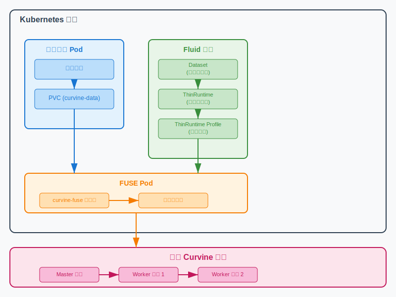
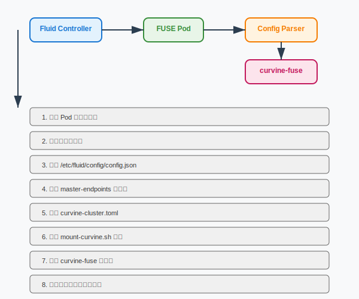

# Curvine 与 Fluid 集成

本文档介绍如何使用 Fluid 的 ThinRuntime 功能将 Curvine 分布式文件缓存系统接入 Kubernetes 集群，实现云原生数据编排和管理。

## 概述

### 什么是 Fluid

[Fluid](https://github.com/fluid-cloudnative/fluid/tree/master) 是一个开源的云原生数据编排和管理系统，专注于解决大数据和AI场景下数据密集型应用的数据访问问题。它提供了统一的数据访问接口，支持多种数据缓存引擎。

### 什么是 ThinRuntime

ThinRuntime 是 Fluid 提供的轻量级运行时，允许用户将任何 POSIX 兼容的文件系统通过 FUSE 接口接入 Fluid 生态系统。与传统的 AlluxioRuntime 或 JuiceFSRuntime 相比，ThinRuntime 具有以下特点：

- **轻量级**：无需部署额外的缓存层或元数据服务
- **灵活性**：支持任何 FUSE 兼容的文件系统
- **简单性**：配置简单，易于维护
- **高效性**：直接访问底层存储，减少数据传输开销

### 集成架构



## 环境要求

在开始之前，请确保：

1. **Kubernetes 集群**：版本 >= 1.18
2. **Fluid 系统**：已在集群中安装 Fluid >= 0.9.0
3. **Curvine 集群**：已部署并运行的 Curvine 分布式文件系统
4. **权限要求**：具有创建 ThinRuntimeProfile、Dataset 和 ThinRuntime 资源的权限
5. **Docker 环境**：用于构建 Curvine ThinRuntime 镜像

### 安装 Fluid

如果尚未安装 Fluid，请参考以下步骤：

```bash
# 使用 Helm 安装 Fluid
helm repo add fluid https://fluid-cloudnative.github.io/charts
helm repo update
kubectl create ns fluid-system
helm install fluid fluid/fluid --namespace=fluid-system --insecure-skip-tls-verify

# 或安装开发版本
helm install fluid fluid/fluid --devel --version 1.0.7-alpha.5 -n fluid-system --insecure-skip-tls-verify
```

## 构建 Curvine ThinRuntime 镜像

### 第一步：编译 Curvine

首先需要编译整个 Curvine 项目：

```bash
# 在 Curvine 项目根目录执行
cd /path/to/curvine
make all
```

**编译说明**：
- `make all` 会编译整个 Curvine 项目，包括：
  - Master 节点程序
  - Worker 节点程序  
  - FUSE 客户端 (`curvine-fuse`)
  - S3 网关
  - CLI 工具
- 编译产物会生成在 `build/dist/` 目录下
- 确保 `build/dist/lib/curvine-fuse` 文件存在，这是 FUSE 客户端的核心程序

### 第二步：构建 Docker 镜像

```bash
cd curvine-docker/fluid/thin-runtime
./build-image.sh
```

**构建过程说明**：

1. **环境检查**：脚本会检查必要的构建文件是否存在
2. **创建构建上下文**：复制所需文件到临时目录
3. **Docker 镜像构建**：使用 Ubuntu 24.04 作为基础镜像
4. **依赖安装**：安装 FUSE3、Python3 等运行时依赖
5. **文件复制**：将编译好的 Curvine 程序复制到镜像中
6. **权限设置**：设置可执行权限和环境变量

构建完成后会生成镜像：`fluid-cloudnative/curvine-thinruntime:v1.0.0`

### 第三步：加载镜像到集群

对于 minikube 测试环境：
```bash
# 删除旧镜像（如果存在）
minikube image rm docker.io/fluid-cloudnative/curvine-thinruntime:v1.0.0

# 加载新镜像
minikube image load fluid-cloudnative/curvine-thinruntime:v1.0.0
```

对于生产环境：
```bash
# 推送到镜像仓库
docker tag fluid-cloudnative/curvine-thinruntime:v1.0.0 your-registry.com/curvine-thinruntime:v1.0.0
docker push your-registry.com/curvine-thinruntime:v1.0.0
```

## 部署和配置

### 第一步：创建 ThinRuntimeProfile

ThinRuntimeProfile 定义了 Curvine FUSE 客户端的运行时配置：

```yaml
apiVersion: data.fluid.io/v1alpha1
kind: ThinRuntimeProfile
metadata:
  name: curvine-profile
spec:
  fileSystemType: fuse
  fuse:
    image: fluid-cloudnative/curvine-thinruntime
    imageTag: v1.0.0
    imagePullPolicy: IfNotPresent
```

应用配置：
```bash
kubectl apply -f curvine-profile.yaml
```

**参数说明**：
- `fileSystemType: fuse`：指定使用 FUSE 类型的文件系统
- `image`：指定 FUSE 客户端的 Docker 镜像
- `imageTag`：镜像版本标签
- `imagePullPolicy: IfNotPresent`：优先使用本地镜像

### 第二步：创建 Dataset

Dataset 定义了数据源的位置和访问方式：

```yaml
apiVersion: data.fluid.io/v1alpha1
kind: Dataset
metadata:
  name: curvine-dataset
spec:
  mounts:
  - mountPoint: curvine:///data  # Curvine 文件系统路径
    name: curvine
    options:
      master-endpoints: "192.168.10.9:8995"  # Curvine Master 地址
  accessModes:
    - ReadOnlyMany  # 访问模式
```

应用配置：
```bash
kubectl apply -f curvine-dataset.yaml
```

**参数说明**：
- `mountPoint: curvine:///data`：指定要访问的 Curvine 文件系统路径
- `master-endpoints`：Curvine Master 节点的 RPC 服务地址和端口
- `accessModes: [ReadOnlyMany]`：支持多个 Pod 同时只读访问

### 第三步：创建 ThinRuntime

ThinRuntime 连接 Dataset 和 ThinRuntimeProfile：

```yaml
apiVersion: data.fluid.io/v1alpha1
kind: ThinRuntime
metadata:
  name: curvine-dataset # 必须与 Dataset 名称一致
spec:
  profileName: curvine-profile
```

应用配置：
```bash
kubectl apply -f curvine-thinruntime.yaml
```

**参数说明**：
- `name: curvine-dataset`：必须与 Dataset 的名称完全一致
- `profileName: curvine-profile`：引用第一步创建的 ThinRuntimeProfile

### 第四步：验证部署

检查 Dataset 状态：
```bash
kubectl get dataset curvine-dataset
```

期望输出：
```
NAME              UFS TOTAL SIZE   CACHED   CACHE CAPACITY   CACHED PERCENTAGE   PHASE   AGE
curvine-dataset   [Calculating]    N/A      N/A              N/A                 Bound   1m
```

检查 ThinRuntime 状态：
```bash
kubectl get thinruntime curvine-dataset
```

检查 FUSE Pod 状态：
```bash
kubectl get pods -n fluid-system | grep curvine
```

**验证说明**：
- **Dataset 状态**：`PHASE` 应该显示为 `Bound`
- **ThinRuntime 状态**：应该显示为 `Ready`
- **FUSE Pod 状态**：应该有一个 `curvine-dataset-fuse-xxx` Pod 处于 `Running` 状态

## 使用示例

### 创建测试应用

创建一个 Pod 来访问 Curvine 文件系统：

```yaml
apiVersion: v1
kind: Pod
metadata:
  name: test-curvine
spec:
  containers:
    - name: nginx
      image: nginx:latest
      command: ["bash"]
      args:
      - -c
      - ls -lh /data && cat /data/testfile && sleep 3600
      volumeMounts:
        - mountPath: /data
          name: data-vol
  volumes:
    - name: data-vol
      persistentVolumeClaim:
        claimName: curvine-dataset
```

应用并测试：
```bash
kubectl apply -f test-pod.yaml
kubectl logs test-curvine
```

### 数据访问验证

进入 Pod 验证文件系统访问：
```bash
kubectl exec -it test-curvine -- bash
ls -la /data/
df -h /data/
```

## 技术原理

### 配置解析流程

Curvine ThinRuntime 镜像中包含一个配置解析器 (`fluid-config-parse.py`)，它的工作流程如下：



### 配置文件转换

配置解析器将 Fluid 的 JSON 配置转换为 Curvine 的 TOML 配置：

**输入（Fluid JSON 配置）**：
```json
{
  "mounts": [{
    "mountPoint": "curvine:///data",
    "options": {
      "master-endpoints": "192.168.10.9:8995"
    }
  }],
  "targetPath": "/runtime-mnt/thin/default/curvine-dataset/thin-fuse"
}
```

**输出（Curvine TOML 配置）**：
```toml
format_master = false
format_worker = false
testing = false
cluster_id = "curvine"

[master]
hostname = "192.168.10.9"
rpc_port = 8995
web_port = 8080

[[client.master_addrs]]
hostname = "192.168.10.9"
port = 8995

[fuse]
debug = false
io_threads = 32
worker_threads = 56
mnt_path = "/runtime-mnt/thin/default/curvine-dataset/thin-fuse"
fs_path = "/data"
```

### FUSE 客户端启动

配置解析器还会生成启动脚本 `mount-curvine.sh`：

```bash
#!/bin/bash
set -ex

export CURVINE_HOME="/opt/curvine"
export CURVINE_CONF_FILE="/opt/curvine/conf/curvine-cluster.toml"

# Create necessary directories
mkdir -p /runtime-mnt/thin/default/curvine-dataset/thin-fuse
mkdir -p /tmp/curvine/meta
mkdir -p /opt/curvine/logs

# Cleanup previous mounts
umount -f /runtime-mnt/thin/default/curvine-dataset/thin-fuse 2>/dev/null || true

# Start curvine-fuse
exec /opt/curvine/lib/curvine-fuse \
    --mnt-path /runtime-mnt/thin/default/curvine-dataset/thin-fuse \
    --mnt-number 1 \
    --conf $CURVINE_CONF_FILE
```

## 使用场景

通过 Fluid 集成，Curvine 可以高效支持多种云原生应用场景，充分发挥分布式缓存的优势：

| 应用场景 | 访问模式 | Curvine 优势 | Fluid 集成价值 | 典型应用 |
|----------|----------|--------------|----------------|----------|
| **大数据处理** | ReadOnlyMany | 数据本地化缓存<br/>高吞吐量读取 | 多 Pod 并行访问<br/>统一数据源管理 | Spark、Flink 批处理任务 |
| **AI/ML 训练** | ReadWriteMany | 热点数据缓存<br/>检查点快速保存 | GPU 节点数据就近访问<br/>训练任务弹性伸缩 | PyTorch、TensorFlow 训练 |
| **微服务配置** | ReadOnlyMany | 配置文件缓存<br/>快速启动加载 | 配置统一分发<br/>服务快速扩容 | 配置中心、静态资源 |
| **数据科学平台** | ReadWriteMany | 交互式数据访问<br/>实验结果共享 | 团队协作环境<br/>资源按需分配 | JupyterHub、数据分析 |
| **内容分发** | ReadOnlyMany | 边缘缓存加速<br/>多地域同步 | 内容就近分发<br/>负载均衡访问 | CDN、静态网站 |
| **日志分析** | ReadWriteMany | 流式数据写入<br/>历史数据查询 | 日志集中存储<br/>分析工具统一接入 | ELK Stack、监控系统 |

### 核心优势

**结合 Fluid 后，Curvine 提供的核心能力**：

1. **数据本地化**：通过 Curvine 的分布式缓存，将热点数据缓存到计算节点附近，减少网络 I/O
2. **弹性扩展**：Fluid 的 Dataset 抽象配合 Curvine 的动态扩容，支持应用负载的弹性伸缩
3. **统一接口**：通过 POSIX 兼容的文件系统接口，应用无需修改即可享受缓存加速
4. **多租户支持**：不同 Dataset 可配置不同的 Curvine 集群，实现资源隔离和管理
5. **云原生集成**：与 Kubernetes 生态深度集成，支持声明式配置和自动化运维

## 高级配置

### 多集群支持

可以为不同的 Curvine 集群创建不同的 Dataset：

```yaml
# 生产环境集群
apiVersion: data.fluid.io/v1alpha1
kind: Dataset
metadata:
  name: curvine-prod
spec:
  mounts:
  - mountPoint: curvine:///prod-data
    name: curvine-prod
    options:
      master-endpoints: "curvine-prod-master:8995"
  accessModes:
    - ReadWriteMany

---
# 测试环境集群
apiVersion: data.fluid.io/v1alpha1
kind: Dataset
metadata:
  name: curvine-test
spec:
  mounts:
  - mountPoint: curvine:///test-data
    name: curvine-test
    options:
      master-endpoints: "curvine-test-master:8995"
  accessModes:
    - ReadWriteMany
```

### 性能调优

在 ThinRuntimeProfile 中可以配置 FUSE 性能参数：

```yaml
apiVersion: data.fluid.io/v1alpha1
kind: ThinRuntimeProfile
metadata:
  name: curvine-profile-optimized
spec:
  fileSystemType: fuse
  fuse:
    image: fluid-cloudnative/curvine-thinruntime
    imageTag: v1.0.0
    imagePullPolicy: IfNotPresent
    env:
      - name: CURVINE_IO_THREADS
        value: "64"
      - name: CURVINE_WORKER_THREADS
        value: "128"
    resources:
      requests:
        memory: "1Gi"
        cpu: "500m"
      limits:
        memory: "2Gi"
        cpu: "1000m"
```

### 支持的环境变量

配置解析器支持以下环境变量来自定义 FUSE 客户端行为：

| 环境变量 | 描述 | 默认值 | 示例 |
|----------|------|--------|------|
| `CURVINE_IO_THREADS` | IO 线程数，影响并发 I/O 操作性能 | 32 | 64 |
| `CURVINE_WORKER_THREADS` | 工作线程数，影响请求处理能力 | 56 | 128 |
| `CURVINE_MASTER_ENDPOINTS` | Master 节点地址 | 无 | master:8995 |
| `CURVINE_MASTER_WEB_PORT` | Master Web 端口 | 8080 | 8080 |

这些环境变量可以通过 ThinRuntimeProfile 的 `env` 配置传递给 FUSE Pod，配置解析器会自动读取并应用到 curvine-fuse 启动参数中。

## 故障排除

### 常见问题

#### 1. Dataset 状态异常

**问题**：Dataset 长时间处于 `NotBound` 状态

**排查步骤**：
```bash
# 检查 ThinRuntimeProfile 是否存在
kubectl get thinruntimeprofile curvine-profile

# 检查 ThinRuntime 状态
kubectl get thinruntime curvine-dataset -o yaml

# 查看 Fluid 控制器日志
kubectl logs -n fluid-system -l app=dataset-controller
```

#### 2. FUSE Pod 启动失败

**问题**：FUSE Pod 处于 `CrashLoopBackOff` 状态

**排查步骤**：
```bash
# 查看 Pod 日志
kubectl logs -n fluid-system curvine-dataset-fuse-xxx

# 检查镜像是否存在
kubectl describe pod -n fluid-system curvine-dataset-fuse-xxx

# 进入 Pod 调试（如果 Pod 运行中）
kubectl exec -it -n fluid-system curvine-dataset-fuse-xxx -- bash
```

#### 3. 镜像拉取失败

**问题**：
```
Failed to pull image "fluid-cloudnative/curvine-thinruntime:v1.0.0": 
Error response from daemon: pull access denied
```

**解决方案**：
```bash
# 确保镜像已加载到集群
minikube image ls | grep curvine

# 重新加载镜像
minikube image load fluid-cloudnative/curvine-thinruntime:v1.0.0

# 确保 imagePullPolicy 设置正确
kubectl get thinruntimeprofile curvine-profile -o yaml
```

#### 4. Curvine 连接失败

**问题**：FUSE 客户端无法连接到 Curvine Master

**排查步骤**：
```bash
# 检查网络连通性
kubectl exec -it -n fluid-system curvine-dataset-fuse-xxx -- ping 192.168.10.9

# 检查端口连通性
kubectl exec -it -n fluid-system curvine-dataset-fuse-xxx -- telnet 192.168.10.9 8995

# 检查生成的配置文件
kubectl exec -it -n fluid-system curvine-dataset-fuse-xxx -- cat /opt/curvine/conf/curvine-cluster.toml
```

#### 5. GLIBC 版本错误

**问题**：
```
/opt/curvine/lib/curvine-fuse: /lib/x86_64-linux-gnu/libc.so.6: 
version `GLIBC_2.39' not found
```

**解决方案**：确保使用正确的基础镜像
```dockerfile
FROM ubuntu:24.04  # 使用较新版本的 Ubuntu
```

### 调试命令

```bash
# 查看所有相关资源
kubectl get thinruntimeprofile,dataset,thinruntime,pvc

# 查看 Fluid 系统组件状态
kubectl get pods -n fluid-system

# 查看详细事件
kubectl get events --sort-by='.lastTimestamp'

# 清理资源（重新部署时）
kubectl delete dataset curvine-dataset
kubectl delete thinruntime curvine-dataset
kubectl delete thinruntimeprofile curvine-profile
```

## 最佳实践

### 1. 环境规划

- **开发环境**：使用单节点 Curvine 集群，简化配置
- **测试环境**：使用多节点集群，验证高可用性
- **生产环境**：使用分布式部署，配置监控和备份

### 2. 资源管理

- 为每个环境创建独立的 Namespace
- 使用 ResourceQuota 限制资源使用
- 配置适当的 PodDisruptionBudget

### 3. 安全配置

- 启用 Curvine 集群认证
- 使用 Kubernetes Secret 管理敏感信息
- 配置网络策略限制访问

### 4. 镜像管理

- 使用版本标签管理镜像
- 定期更新基础镜像
- 在生产环境中使用私有镜像仓库

## 相关链接

- [Fluid 官方文档](https://github.com/fluid-cloudnative/fluid/blob/master/docs/zh/userguide/install.md)
- [ThinRuntime 示例](https://github.com/fluid-cloudnative/fluid/blob/master/docs/zh/samples/thinruntime.md)
- [Kubernetes FUSE 支持](https://kubernetes.io/docs/concepts/storage/volumes/#fuse)
- [FUSE 文档](https://www.kernel.org/doc/html/latest/filesystems/fuse.html)
